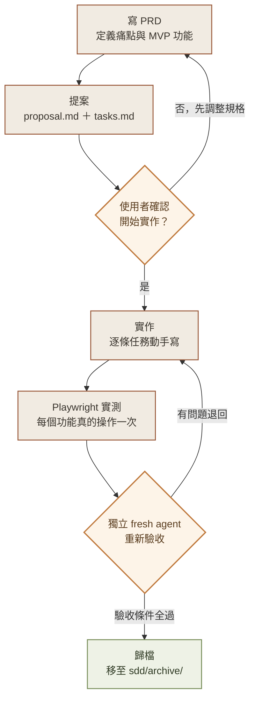
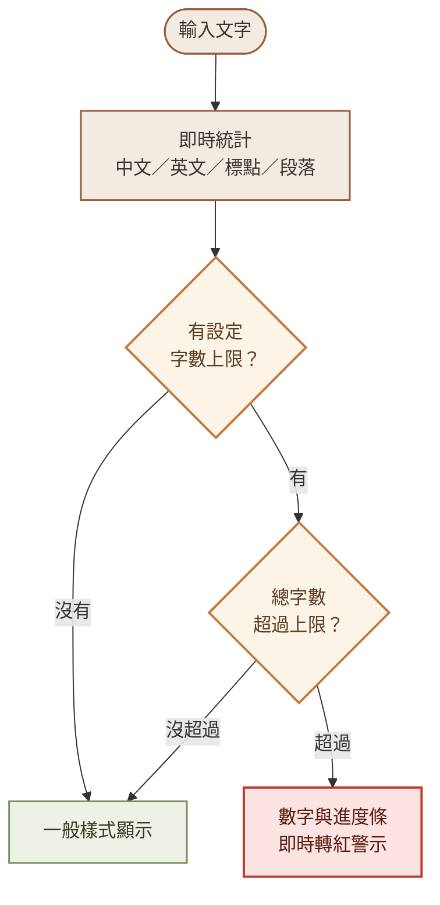
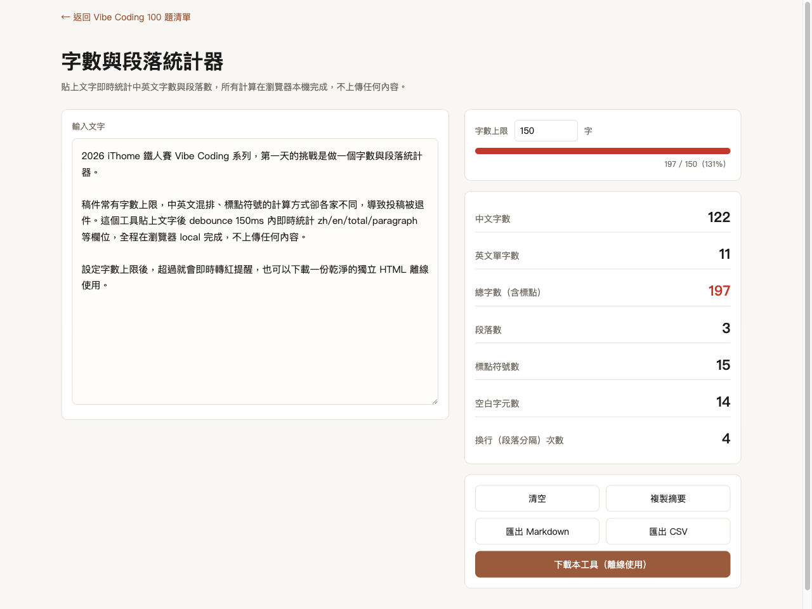
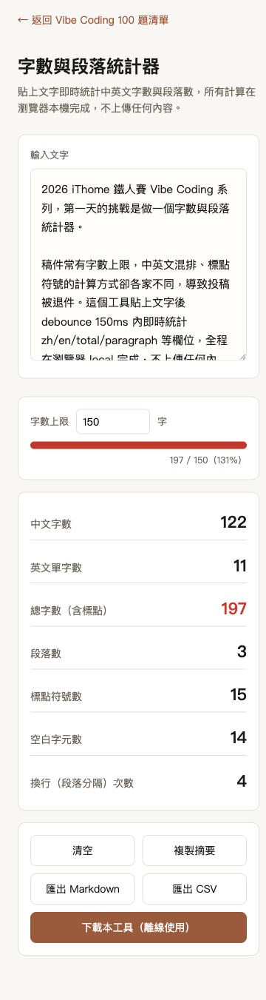

# Day 1：一個字數統計器，跑完一次完整的 Vibe Coding

> 👉 **直接玩玩看**：[字數與段落統計器（GitHub Pages）](https://lushinshang.github.io/2026ironman/VibeCoding/Day1/index.html) ・ [原始碼](https://github.com/lushinshang/2026ironman/tree/main/VibeCoding/Day1)

**目錄**
[1. 情境](#1-情境) · [2. 解題思路](#2-解題思路) · [3. 資源](#3-資源) · [4. Vibe 過程](#4-vibe-過程) · [5. 產品](#5-產品) · [6. 心得與反思](#6-心得與反思)

---

## 1. 情境

稿子交出去三分鐘，退件信就回來了：「字數超標，請刪減至 500 字以內重新送出。」

打開 Word 的字數統計，顯示 487 字。打開投稿系統再貼一次，顯示 521 字。兩邊都沒算錯，只是「字數」這件事本身沒有共識——中文字算不算標點？英文單字要不要拆開算？空白跟換行到底算不算數。稿件、公告、核銷單這類文件常年卡在這種模糊地帶，等到真的被退件才發現，已經來不及了。

這是 2026 iThome 鐵人賽 Vibe Coding 系列的第一天。30 天要交出 30 個「任何人都能上手、無痛解決日常辦公痛點」的小工具，第一天就挑了這個最貼身的問題：做一個貼上文字就能立刻看到中文字數、英文字數、含標點總字數、段落數的統計器，規則透明到使用者自己都對得上帳。

## 2. 解題思路

工具本身不難，真正要想清楚的是「怎麼做才不會走歪」。

交付形式先定案：稿件字數這種資訊沒理由經過任何伺服器，所以直接鎖定純前端、零依賴的單一 HTML 檔——貼上文字，瀏覽器本機算完，連一個網路請求都不該出現。這個決定順便定了驗收標準的一半：Network 面板要是空的，`file://` 雙擊打開也要能正常運作。

形式定了，流程也要走一遍完整的規格先行，而不是想到什麼寫什麼。先把「字數與段落統計器」寫成一份 PRD——痛點、目標使用者、MVP 功能表、驗收標準、明確排除的範圍。中途追加了兩個需求（自訂字數上限的超標警示、匯出 Markdown/CSV），PRD 就跟著改了兩輪，不是先寫死再將就。

PRD 定案後冒出一個容易被忽略的問題：這是個網頁工具，要不要另開一份正式的 UI 設計文件？答案是不用。這種單頁小工具——一個 textarea、幾張統計卡片、幾顆按鈕——PRD 裡一段文字描述版面就夠了，另開設計文件反而是多做工。但完全不畫圖也有風險，折衷是在技術提案裡塞一份純文字的 wireframe 草圖，桌面版、手機版各畫一次，把「上限輸入框放哪、進度條在哪」先在紙上定案。

整個流程走下來大概是這樣：

規格轉成技術提案跟任務清單之後，才是動手寫程式碼的起點。每一條任務的「完成」不是自己說了算——這點放到第 4 節細講。

## 3. 資源

這次用到的東西其實都不特別，特別的是怎麼組合：

- **Claude Code**：主要協作介面，走完 SDD（規格驅動開發）三階段——提案、實作、歸檔
- **PRD.md / proposal.md / tasks.md**：整個流程的骨架，PRD 定「做什麼」，proposal 定「怎麼做」，tasks 拆成可勾選的小任務並附驗收條件
- **Playwright MCP**：最關鍵的一塊，不是拿來看畫面，是拿來真的操作瀏覽器——灌文字進 textarea、點按鈕、攔截下載的 Blob 內容、讀 DOM 上的 class 有沒有正確套用
- **`python3 -m html.parser`**：最基本的語法驗證，零成本但不能省
- **一支獨立的 fresh agent**：完全不知道前面實作細節，專門負責最後驗收，不接受「我自己測過了」這種說法

## 4. Vibe 過程

工具本身的程式碼量不大，時間反而都花在「怎麼確定這是對的」上面。

統計邏輯寫完那一刻，第一直覺是「應該沒問題」——但這句話這次直接被否決掉。改成用 Playwright 對 DOM 灌入一段人工先算過一遍的中英文混排文字，逐項比對中文字數、英文字數、總字數、段落數、標點符號數，跟手算結果一個一個核對；全空白、全換行輸入也另外測一次，確認不會跑出 `NaN`。這個習慣延續到每一個功能：超標該不該轉紅字，就直接設上限、輸入超量文字，讀 DOM 上 `.over` 這個 class 有沒有被加上去；匯出按鈕按下去，就攔截瀏覽器準備下載的 Blob，把內容讀出來跟畫面數字對一次。判斷邏輯畫出來大概是這樣：

中間卡了一個小意外：Playwright 預設擋掉 `file://` 協定，沒辦法直接測「使用者雙擊打開 HTML 檔」這個最終使用情境。繞過的方法是先用 `python3 -m http.server` 起一個本機伺服器，讓自動化測試走 `http://127.0.0.1`；`file://` 這條驗收條件則另外用系統的 `open` 指令實際打開看一眼。兩條路徑加起來，才算真的把這條驗收條件蓋到。

八個任務全部做完、自己測過一輪，並沒有就此喊完成——依流程規定，驗證不能自己驗自己。於是另外派了一個完全不知道前面實作細節的全新 agent，只給它規格文件跟驗收條件，讓它自己動手重測一遍。結果七條驗收條件全過，agent 還順手抓到一個文件措辭上的小瑕疵：「全空白時所有統計為 0」這句話字面上不夠精確，因為空白字元數欄位本來就該顯示真實數量，不是空字串才會是 0——不是程式錯誤，但值得回頭改一下規格文件的用字。

功能做完之後，多跑一輪資安源碼檢測：整份程式碼從頭讀一次，逐項比對 XSS、注入、資料外洩、CSV 公式注入這幾類常見問題。因為畫面更新全程只用 `textContent`、沒有任何對外請求、匯出的檔案也不含使用者原始輸入的文字，這輪檢測沒抓到高信心漏洞。

最後把工具跟系列首頁互相連起來，首頁題目清單點得進工具、工具頁面也點得回首頁——一樣不是改完就算，是真的在瀏覽器裡點了兩次連結，確認兩個方向都能正確跳轉。

工具上線之後又追加了一輪：想離線用的話，得先知道瀏覽器「另存新檔」這招，不是每個人都想得到，所以加了一顆「下載本工具」按鈕。做法上刻意不用 `fetch()` 重新抓一次網頁——那樣在 `file://` 底下會直接被 CORS 擋掉，等於離線需求自己打自己臉——改成複製目前的 DOM、把 textarea 內容、超標警示、統計數字這些動態狀態清乾淨，再序列化下載。做完自己測過一輪、也派了 fresh agent 重新驗收一次，四條驗收條件都過，正打算收尾歸檔——結果被抓到一個沒想到的地方：頁面上「返回首頁」那顆連結是相對路徑，下載到別的資料夾之後這個連結根本連不到任何東西。單一 HTML 檔案的重點就是「打開就能用，不依賴任何外部東西」，一個會連到不存在路徑的連結違背了這個前提，於是在下載邏輯裡多加一步，把這顆連結從複製出來的 DOM 裡整個拿掉，再測一次確認下載出來的檔案裡真的一個 `<a>` 標籤都沒有。

## 5. 產品

最後交付的是一個單一檔案的 `index.html`，打開就能用，不用安裝、不用網路：

<table>
<tr>
<td width="50%">

**桌面版**（設定上限 150 字、超標即時轉紅，底部可下載獨立 HTML）

</td>
<td width="50%">

**手機版**（375px 寬，版面自動收成單欄）

</td>
</tr>
</table>

功能清單：

- 貼上文字，即時顯示中文字數、英文單字數、含標點總字數、段落數、標點符號數、空白與換行數
- 可設定字數上限，超過時統計數字與進度條即時轉紅
- 一鍵複製統計摘要、一鍵清空
- 一鍵匯出 Markdown 或 CSV 格式的統計報告
- 一鍵下載乾淨的獨立 HTML 副本（不含當下輸入的文字、不含任何連結），存到本機後完全離線使用
- 全程零外部依賴，`file://` 直接開啟也能用，操作過程沒有任何一筆對外網路請求

**線上體驗**：[lushinshang.github.io/2026ironman/VibeCoding/Day1](https://lushinshang.github.io/2026ironman/VibeCoding/Day1/index.html)
**原始碼**：[github.com/lushinshang/2026ironman](https://github.com/lushinshang/2026ironman/tree/main/VibeCoding/Day1)

## 6. 心得與反思

這一天真正的產出不是那個統計器，是把「怎麼確認一件事真的做完了」這個習慣走了一遍完整流程。統計邏輯寫完那一刻，最省事的做法就是相信自己寫對了；這次每個功能都改成真的在瀏覽器裡操作一次、讀真實的 DOM 狀態。過程裡也沒抓到什麼驚天大 bug，但至少「應該沒問題」這句話，這次沒有出現在任何一次回報裡。

過程裡也踩到一個跟程式碼無關的坑。專案規範要求使用者提到「log」這個關鍵字時，要主動執行一支既有的日誌產生腳本，把對話歷程存下來。照做之後腳本直接報錯——它原本是為另一套 CLI 工具的逐字稿格式寫的，跟目前使用的環境完全對不上。一開始差點被「規範寫著要做」這件事牽著走，後來還是先老實跑一次確認腳本到底能不能動，動不了就承認動不了，改用同樣的格式手動整理一份日誌，而不是假裝腳本跑成功、或乾脆跳過這步不提。這件事後來也被記成一條教訓，寫進給下一次協作用的筆記裡——踩過的坑，至少不要讓下一個人（或下一次的自己）重踩一遍。

30 天只完成了第一天，但這一天定下的節奏——先寫清楚規格、真的動手測、不自己驗自己——應該會是接下來 29 天共用的底子。
