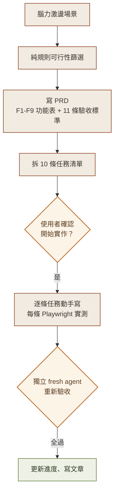
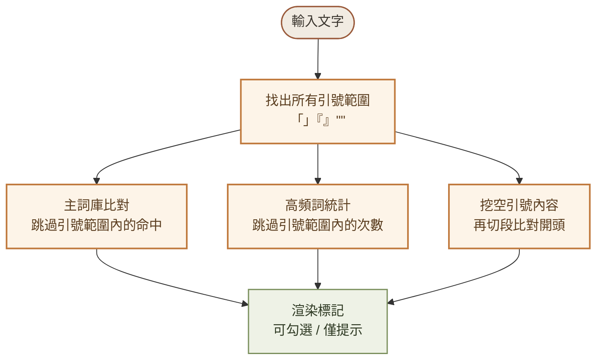
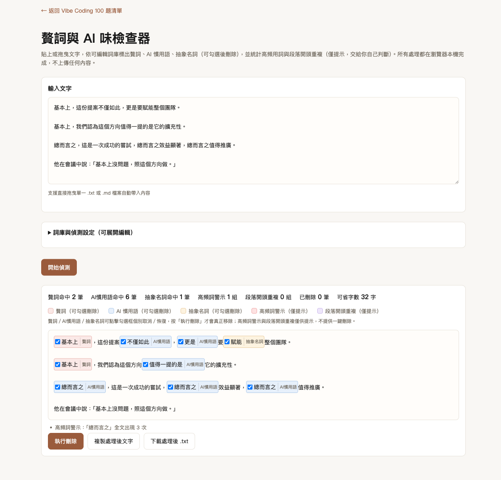

# Day 2：本來要做排版工具，結果做了一個抓 AI 味的檢查器

> 👉 **原始碼**：[Day2/index.html](https://github.com/lushinshang/2026ironman/tree/main/VibeCoding/Day2)（GitHub Pages 連結待推送部署後補上，見文末說明）

**目錄**
[1. 情境](#1-情境) · [2. 解題思路](#2-解題思路) · [3. 資源](#3-資源) · [4. Vibe 過程](#4-vibe-過程) · [5. 產品](#5-產品) · [6. 心得與反思](#6-心得與反思)

---

## 1. 情境

Day2 一開始的題目其實不是這個。依照 Day1-5「個人寫作發布流程」的規劃，Day2 排定的是「中英文排版工具」——中英文夾雜時自動補半形空格，100 題清單裡的第 10 題。

規格都還沒動筆，就先被自己問倒了：這個功能真的有人需要嗎？

pangu.js 這類函式庫早就把「中英文自動空格」這件事解決得很成熟，很多部落格平台、Markdown 編輯器本身就有近似處理。真要做出差異化，純規則式的準確度天花板也不高，做完搞不好只解決七八成情況，使用者還是得肉眼複查。既然要花一整天做，不如先確認這一步「定稿前檢查」在整個寫作流程裡，真正卡住人的地方到底是什麼。

答案不是排版，是贅詞跟 AI 腔。用 AI 協作寫初稿，「基本上」「其實」「不僅如此」「值得一提的是」這類詞會反覆出現，單獨看一次沒問題，整篇高頻出現就很刺眼，肉眼很難抓出「整篇統計上」的重複——這比補空格更貼近「文章品質」，不只是「視覺格式」。

## 2. 解題思路

換題目之前，先把「換不換」這件事本身想清楚，而不是感覺不對就直接跳下一個。

第一步是逐一檢視 Day1-5 這條「個人寫作發布流程」的五個步驟，不只看 Day2，連已排定的 Day5（QR Code／分享連結產生器）也一起重新檢視強弱：

| Day | 原定主題 | 步驟定位 | 判斷 |
|---|---|---|---|
| 1 | 字數統計 | 寫作中檢查 | ✅ 強，保留 |
| 2 | 中英文排版 | 定稿前檢查 | ❌ 弱，有成熟方案可取代 |
| 3 | 台灣用語轉換器 | 在地化校正 | ⚠️ 中強，離線＋可編輯詞庫仍有差異化空間 |
| 4 | Markdown 轉 HTML | 轉發布格式 | ✅ 強，非工程師真實需求 |
| 5 | QR Code／分享連結 | 分享收尾 | ❌ 弱，部落格平台本身就有分享功能 |

Day2 跟 Day5 都是弱環，但這次先只換掉 Day2，Day5 留著晚點再議——一次只解一個問題，不要因為在檢視一件事，就把整條流程全部打掉重做。

換題目的過程也不是直接拍板決定，而是先做了一輪場景腦力激盪：誰會用（部落格定稿前、公文潤飾、審稿抓 AI 代寫）、贅詞跟 AI 味的不同類型（純贅字、冗長句型、重複用詞、排比結構）、邊界情況（引用文字裡的贅詞不該被誤判）。

腦力激盪完，緊接著做一輪「這是純前端零依賴的離線 HTML，哪些場景做得到、哪些做不到」的可行性篩選：

| 想做的事 | 可行嗎 | 原因 |
|---|---|---|
| 固定詞庫比對贅詞、AI 慣用語 | ✅ | 字串比對，純規則 |
| 全文詞頻統計、超過門檻才標紅 | ✅ | 計數 + 比對，純規則 |
| 段落開頭同構偵測 | ✅ | 純字串處理，不需語意理解 |
| 冗長句型自動改寫 | ❌ | 中文語法重組需要句法分析，硬做會產生錯誤句子 |
| 排比結構的語法對稱性判斷 | ❌ | 只能抓「已知固定連接詞組合」，抓不到所有變化形式 |
| AI 味濃度百分比評分 | ❌ | 「過度」是主觀語意判斷，規則沒辦法量化 |

篩選完，工具的定位就清楚了：**標記，不改寫**——三種可勾選刪除的詞庫類別（贅詞／AI慣用語／抽象名詞），加上兩種只提示不刪除的統計類警示（高頻詞、段落開頭重複），把「要不要刪」的判斷權完全交還給使用者。

規格定案後，走 SDD（規格驅動開發）三階段流程：

## 3. 資源

- **Claude Code**：主要協作介面，這次多了「先腦力激盪、再篩可行性」這道前置步驟，PRD 動筆前先確認題目本身站不站得住腳
- **PRD.md**：延續 Day1 建立的固定格式（背景痛點、User Story、功能需求表、非必要功能、驗收標準、Out of Scope），沿用同一份文件放在 `Day2/PRD.md`，跟 sdd-flow 通用流程的 `sdd/proposal.md` 格式不同——這點特地跟使用者確認過要沿用專案既有慣例
- **TaskCreate／TaskUpdate**：把 10 條任務清單掛進工具內建的任務追蹤，逐條 `in_progress → completed`，取代另外寫一份 `tasks.md`
- **Playwright MCP**：核心驗證工具，貼文字、勾選框、拖曳檔案、匯入匯出 JSON、攔截下載 Blob，逐項功能都是真的在瀏覽器裡操作過
- **Python Playwright**：MCP 版的 Playwright 擋 `file://` 協定沒辦法測「雙擊開啟」，改用本機安裝的 Python playwright 套件直接開 `file://` 跑一輪
- **一支獨立的 fresh agent**：只給 PRD 跟原始碼，完全不知道我怎麼測過，自己重新測一遍 11 條驗收標準，還自己加測了 3 個邊界情況

## 4. Vibe 過程

功能之間互相牽動，寫的時候是整份 `index.html` 一次寫完主要邏輯，但驗證是拆回 10 條任務逐條做——每完成一個功能點，就用 Playwright 對著瀏覽器實際操作一次，不是寫完就假設它對。

比較有意思的幾個驗證：

**F6 引號排除要同時套用到三個功能，不是各自寫一次。** 贅詞比對、高頻詞統計、段落開頭偵測都要跳過引號內的內容，一開始容易漏掉「段落整段都在引號裡」這種情況——不是引號夾在句子中間，是整個段落被引號包住。測試資料故意寫成「『首先，我們需要』這是引言一段。」跟「『首先，我們需要』這是引言二段。」兩段，如果沒處理好，這兩段開頭前五字完全相同會被誤判成「段落開頭重複」，但因為整段都在引號裡，正確行為應該是完全不列入偵測。做法是先把引號範圍從文字裡「挖空」，再拿挖空後的文字做段落切分跟比對，這樣引號內的內容天生就不會進入判斷範圍。

**高頻詞的門檻邏輯，故意測「差一次」的邊界。** 預設門檻是 3 次，測試資料讓「不僅如此」剛好出現 2 次（不該標紅）、「總而言之」剛好出現 3 次（該標紅），兩組資料放進同一段文字裡一起測，比只測「有標」或「沒標」更容易抓出 `>=` 跟 `>` 寫反的問題。

**詞庫互相重疊會不會被算兩次，是額外多想的一個邊界情況。** 「不僅如此」是主詞庫裡的一整個詞，但如果文字裡除了「不僅如此」還單獨出現一個「不僅」，這兩筆該不該分開算、會不會重疊算成三筆？比對邏輯是先把所有命中依起點排序，同一個起點取最長的那個，貼合的部分互相排斥掉——這個案例原本沒有寫進 PRD 的 11 條驗收標準，是後來自己想到才追加測的。

任務全部做完、自己測過一輪 11 條驗收標準，並沒有就此喊完成。派了一支完全不知道實作細節的 fresh agent，只給它 `PRD.md` 跟 `index.html`，讓它自己重新動手測。結果 11 條全過，agent 還自己多想了 3 個邊界情況去試（詞彙重疊解析、空白輸入直接按偵測、詞庫格式打錯逗號的容錯），確認工具在非預期輸入下不會當機、也不會誤判。

## 5. 產品

最後交付的是 `Day2/index.html`，貼上文字就能看到贅詞、AI 慣用語、抽象名詞被標色標記，統計摘要即時顯示可省字數：

<table>
<tr>
<td width="50%">

**桌面版**（貼入含四種詞庫類型的示範文字，執行偵測後的標記畫面）

</td>
<td width="50%">

**手機版**（375px 寬，詞庫設定區自動收成單欄）

</td>
</tr>
</table>

功能清單：

- 貼上或拖曳 `.txt`／`.md` 文字，依可編輯主詞庫標出贅詞、AI 慣用語、抽象名詞（三色區分，可個別勾選）
- 按「執行刪除」才真正移除已勾選的詞，未勾選的維持原樣——不做任何自動改寫句子
- 高頻監測詞庫統計全文出現次數，達到可調門檻（預設 3 次）才標紅提示，只提示不提供一鍵刪除
- 段落開頭前 N 字（可設定，預設 5 字）重複達 2 段以上會被標記，同樣只提示不刪除
- 「」『』"" 引號內的內容不列入任何偵測，避免引用他人原話被誤判
- 詞庫可在畫面上直接編輯，並支援匯出／匯入 JSON 備份
- 一鍵複製處理後文字、一鍵下載 `.txt`
- 全程零外部依賴，`file://` 直接開啟也能用，操作過程沒有任何一筆對外網路請求

**原始碼**：[github.com/lushinshang/2026ironman/tree/main/VibeCoding/Day2](https://github.com/lushinshang/2026ironman/tree/main/VibeCoding/Day2)
**線上體驗**：待推送部署後補上連結（見第 6 節說明）

## 6. 心得與反思

這一天花最多時間的地方，不是寫程式，是「要不要做這個題目」這個問題本身。原定的中英文排版工具寫規格前先被自己攔下來——先問「這個功能會有需要嗎」，答案是需求強度不夠，才回頭重新檢視整條 Day1-5 的流程設計，換成貼合度更高的題目。比起硬著頭皮把一個弱題目做完，多花時間想清楚「這個題目值不值得做一整天」，換來的是後面規格、驗收標準都寫得更有底氣，不是憑感覺湊功能。

驗證習慣延續 Day1 的做法，但這次多了一個新的坑：一段邏輯被三個功能（F2／F4／F5）共用時，測試資料要故意往「共用邏輯的極端情況」設計，而不是三個功能分開各測一次自己最明顯的案例——第 4 節那個「整段包在引號裡」的測試，就是先想過「三個功能共用同一份挖空邏輯，哪裡最容易漏」才寫出來的，不是踩到才補測。這個習慣比記住某一個具體 bug 更值得留著，下一次遇到別的共用邏輯也用得上。

還有一個誠實要交代的地方：這篇文章的 GitHub Pages 連結目前還沒放，因為 Day2 的程式碼還沒推送上去，沒推送就沒辦法真的 `curl -sI` 測到 200，貼一個沒驗證過的連結等於在文章裡留一個自己都不確定能不能點的東西。等推送部署、確認連結真的能打開，才會回來補上這一段——這也是這 30 天想維持的同一個原則：沒驗證過的事，不會寫得像已經驗證過。
