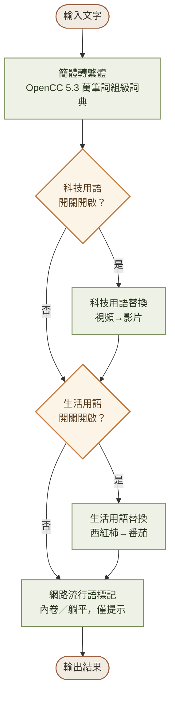
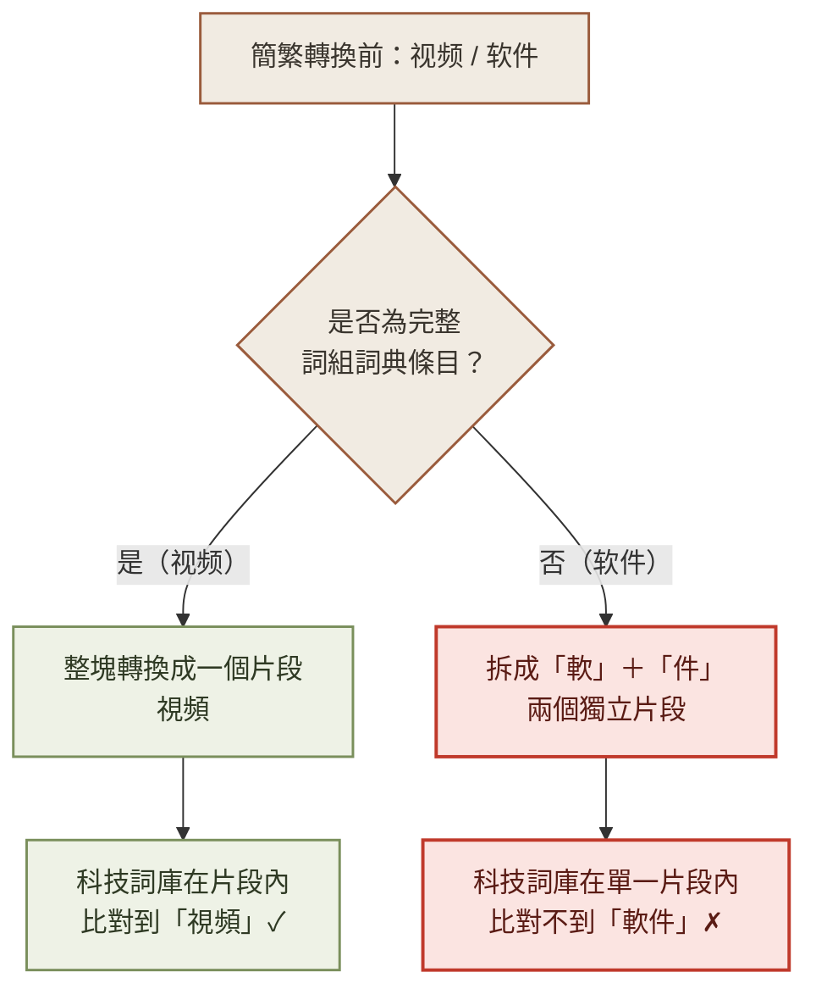
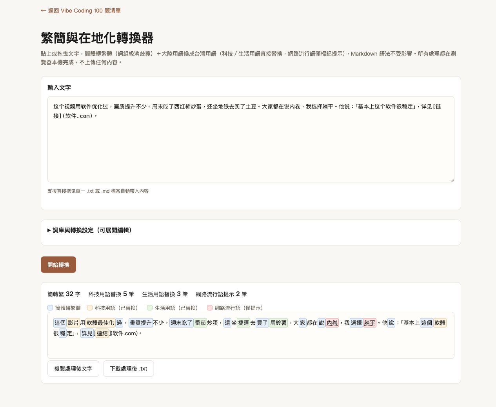
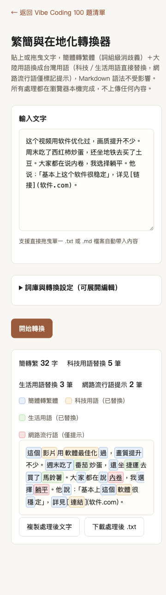

# Day 3：一個「軟件」比對不到「軟件」的 bug，逼我重寫了整個轉換架構

> 👉 **直接玩玩看**：[繁簡與在地化轉換器（GitHub Pages）](https://lushinshang.github.io/2026ironman/VibeCoding/Day3/index.html) ・ [原始碼](https://github.com/lushinshang/2026ironman/tree/main/VibeCoding/Day3)

**目錄**
[1. 情境](#1-情境) · [2. 解題思路](#2-解題思路) · [3. 資源](#3-資源) · [4. Vibe 過程](#4-vibe-過程) · [5. 產品](#5-產品) · [6. 心得與反思](#6-心得與反思)

---

## 1. 情境

Day3 原定題目是「台灣用語轉換器」——依 Day1-5 的管線關係，它接在 Day2（贅詞與 AI 味檢查）之後，是「發布前最後一道語言校對」：把大陸慣用語（視頻、軟件）換成台灣用語，再交給 Day4 轉成網頁發布。

腦力激盪場景時，一個補充打開了範圍：用 AI 翻譯英文產生的中文，就算不含簡體字，用語照樣偏大陸慣用——這個情境的使用頻率其實比「轉載大陸文章」更高，因為多數人不常大量複製貼上對岸內容，但用 AI 翻譯英文卻是日常操作。接著又追加一個問題：「除了用語轉換，加上簡體轉繁體，做得到嗎？」

答案是做得到，但簡體轉繁體有個經典難題：「发」「后」「干」這類字，簡體對繁體不是一對一，是一對多——「头发」要轉成「頭髮」，「以后」要轉成「以後」，同一個「发」字在不同詞裡對到不同繁體字。純粹的單字對照表在這種情況下必然出錯，需要看詞組上下文才能正確判斷。

## 2. 解題思路

面對「單字對照表做不到消歧義」這個問題，有兩條路：自己手刻一份精簡版規則，或是內嵌一份成熟的開源詞典。跟使用者確認後，選擇後者——內嵌 OpenCC（Apache License 2.0）的詞組級詞典，用「最長詞組優先比對」的方式做消歧義，準確度優先於檔案輕量。

翻開本機已安裝的 OpenCC 資料才發現，這個決定順便解決了另一半問題：OpenCC 本身就有一份 `TWPhrases.txt`（509 筆），專門收錄「大陸慣用語→台灣用語」的對照，而且詞條已經是簡轉繁後的繁體字，剛好可以接在簡繁轉換之後直接使用。換句話說，OpenCC 官方的 `s2twp`（簡體轉繁體·台灣標準）轉換鏈本來就是「簡繁轉換 → 用語轉換 → 用字規範化」三段式，跟 Day3 想做的東西完全對上。

於是整個轉換流程定案為四個階段：

科技用語直接沿用 OpenCC 的 509 筆詞典；生活用語（番茄、馬鈴薯、捷運這類日常詞彙）與網路流行語（內卷、躺平，這類沒有台灣對應詞、只能標記提醒的詞）另外手動整理，因為這兩類不是 OpenCC 的收錄範圍。

## 3. 資源

- **Claude Code**：主要協作介面，這次多了一個技術取捨的討論——簡繁詞庫要手刻還是內嵌開源資料，先講清楚兩者的準確度與檔案大小落差，再由使用者決定
- **OpenCC**（Apache License 2.0）：簡繁轉換與科技用語詞庫的資料來源，本機已裝有 Python 版與 Homebrew 版，直接讀取隨附的純文字詞典檔案（`STPhrases.txt`、`STCharacters.txt`、`TWPhrases.txt`、`TWVariants.txt`）
- **Python 組裝腳本**：因為要內嵌的詞典資料超過 1MB、共 5.3 萬多筆，手動貼進 HTML 不可靠，改用腳本讀取詞典檔、轉成緊湊格式、拼進 HTML 模板，每次改動都重新組裝一次，而不是手改巨大檔案
- **Playwright MCP**：核心驗證工具，這次特別吃重在「跨階段鏈式轉換」的驗證——貼一段簡體字，確認它先變繁體、再被換成台灣用語，兩階段的結果都要對得上
- **Python playwright 套件**：`file://` 協定驗證，做法跟 Day1、Day2 一樣
- **一支獨立的 fresh agent**：只給 PRD 跟原始碼重新驗收，這次還意外追加測了一個我沒設計進正式驗收條件、但工具本身有處理好的鏈式案例（見第 4 節）

## 4. Vibe 過程

工具寫完第一版，任務清單逐條測到「科技用語替換」這一步就卡住了。

貼進「视频用软件优化过」這句話，預期「视频」變「影片」、「软件」變「軟體」、「优化」變「最佳化」，結果簡繁轉換正確跑完（「軟」「優」「過」都變成繁體字），但科技用語一個都沒換到，統計顯示「科技用語替換 0 筆」。

第一個念頭是詞庫格式錯了，一查發現真的錯了——內建的科技用語預設資料是從 OpenCC 的 tab 分隔檔案直接轉出來的，但解析函式寫的是找逗號分隔，兩邊格式對不上，全部解析失敗。但修完這個、重新測，還是有一半的詞沒換到：「视频」正確變成「影片」，「软件」卻還是「軟件」，沒有變成「軟體」。

兩個詞同樣是「簡繁轉換完再套用科技用語詞庫」，一個成功一個失敗，代表問題不在詞庫格式，在轉換邏輯本身的架構。追下去才發現：F2 簡繁轉換完，把文字拆成「這段被轉換過」跟「這段沒被轉換」兩種片段（chunk），下一階段的科技用語比對，是在**單一片段內部**找詞——「视频」剛好是 OpenCC 詞組級詞典裡的完整兩字詞，簡繁轉換後變成一整塊「視頻」片段，科技詞庫能在這塊裡面完整比對到「視頻」兩個字；但「软件」不是詞組詞典的完整詞條，簡繁轉換是「软」單字轉成「軟」（一塊片段），「件」這個字本身簡繁相同、完全沒被轉換動到（另一塊片段）——於是「軟」跟「件」被拆進兩個不同片段，科技詞庫要找的兩字詞「軟件」，永遠不可能同時出現在同一個片段裡被比對到。

這個 bug 沒辦法靠調參數修，得換架構。改法是把「拆片段」這件事從資料結構裡拿掉：每一個 stage 都在**完整、沒被前一 stage 切碎**的文字上重新掃描比對，另外用一個跟文字等長的「標籤陣列」記錄每個字元是被哪個 stage 改的——標籤只影響最後渲染顏色，完全不影響下一階段能比對到的範圍。改完之後，「软件」正確被跨越舊片段邊界找到、換成「軟體」；連帶著「视频→視頻（簡繁）→影片（科技用語）」「链接→鏈接（簡繁）→連結（科技用語，因為「鏈接」是大陸慣用寫法）」這類需要兩階段接力才能轉對的詞，也全部正確運作。

任務全部做完、11 條驗收標準自測通過後，照流程派 fresh agent 獨立驗收。這支 agent 沒看過上面這段除錯過程，卻自己想到要測「簡體→繁體→大陸用語→台灣用語」的鏈式轉換案例，並確認「不會漏轉也不會重複轉換」——跟我除錯時踩到的坑是同一類問題，等於從另一個角度把這個架構修正驗證了一次。

## 5. 產品

最後交付的是 `Day3/index.html`，貼上文字執行轉換後，四種類別分別用不同顏色標示：

<table>
<tr>
<td width="50%">

**桌面版**（貼入含簡體字、科技/生活用語、網路流行語、Markdown 語法的綜合示範文字）

</td>
<td width="50%">

**手機版**（375px 寬，詞庫設定區自動收成單欄）

</td>
</tr>
</table>

功能清單：

- 簡體轉繁體：內嵌 OpenCC 開源詞組級詞典（5.3 萬筆），最長詞組優先比對，正確處理「头发→頭髮」「以后→以後」這類一對多歧義字，可獨立開關
- 科技用語、生活用語：命中後直接替換成台灣用語，不需要勾選確認，兩類可分別開關
- 網路流行語：僅標記提示（例如「內卷」「躺平」），不強制替換原文字
- Markdown 語法保護：行內反引號、code block、連結的 `(url)` 部分皆不列入任何一層轉換範圍；連結文字本身仍會正常轉換
- 四個詞庫（簡繁詞組補充、科技用語、生活用語、網路流行語）皆可在畫面上編輯，並支援匯出／匯入 JSON 備份
- 一鍵複製處理後文字、一鍵下載 `.txt`
- 全程零外部依賴，`file://` 直接開啟也能用，操作過程沒有任何一筆對外網路請求（含內嵌的 OpenCC 詞典資料，都是本機內容，不即時連網查詢）

**線上體驗**：[lushinshang.github.io/2026ironman/VibeCoding/Day3](https://lushinshang.github.io/2026ironman/VibeCoding/Day3/index.html)
**原始碼**：[github.com/lushinshang/2026ironman/tree/main/VibeCoding/Day3](https://github.com/lushinshang/2026ironman/tree/main/VibeCoding/Day3)

## 6. 心得與反思

這一天的產品本身不複雜——四層轉換、四個詞庫、一個開關列表，功能清單寫出來平平無奇。真正花時間的是中間那個「軟件比對不到軟件」的 bug：兩個看起來對稱的詞（「视频」跟「软件」），走同一套邏輯，一個對一個錯，這種不對稱的失敗最容易讓人先懷疑錯的地方，浪費時間在改詞庫格式，而不是先問「為什麼這兩個案例的處理路徑不一樣」。

回頭看，這個坑的根源是我在設計資料結構時，把「比對範圍」跟「渲染顏色」這兩件事綁在一起——用同一個「片段」概念同時承擔了兩種責任。拆開來看反而更清楚：比對永遠該在完整文字上做，跟這段文字之前被誰改過沒有關係；「這段是被誰改的」只是最後畫面要顯示的資訊，不該反過來限制下一階段能看到多少文字。這跟 Day2 引號排除、Markdown 保護這類「排除某些範圍」的需求不一樣——那些是真的要排除，這裡卻是不小心把「排除」的機制套用到了不該排除的地方。

fresh agent 這次的驗收也提醒了一件事：驗收條件是我自己寫的，難免有寫規格時沒想到、但工具實際運作中真實存在的案例（這裡是鏈式轉換）。獨立驗收的價值不只是「重新確認寫好的條件有沒有過」，也包含「自己會不會想到規格之外、但同樣重要的測試角度」——這次剛好被它想到了，也剛好驗證了我除錯時最擔心的那個地方。
