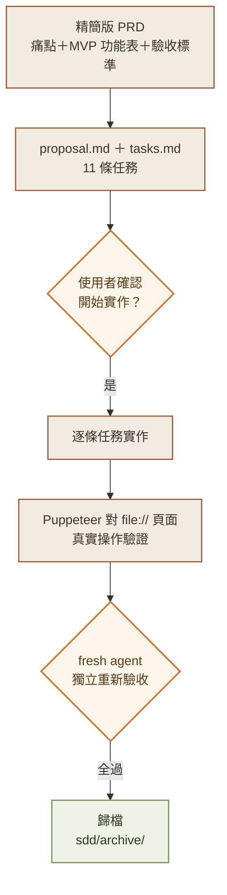
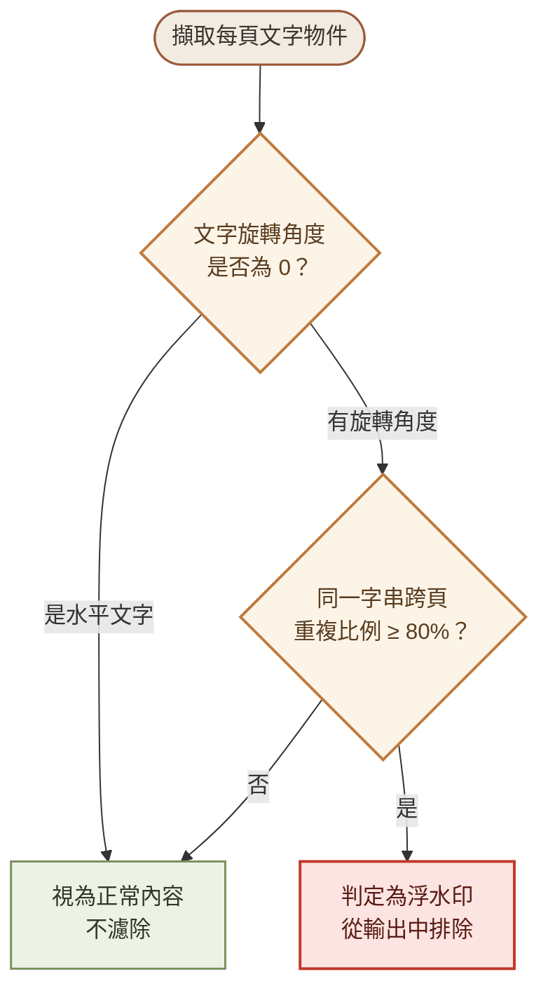
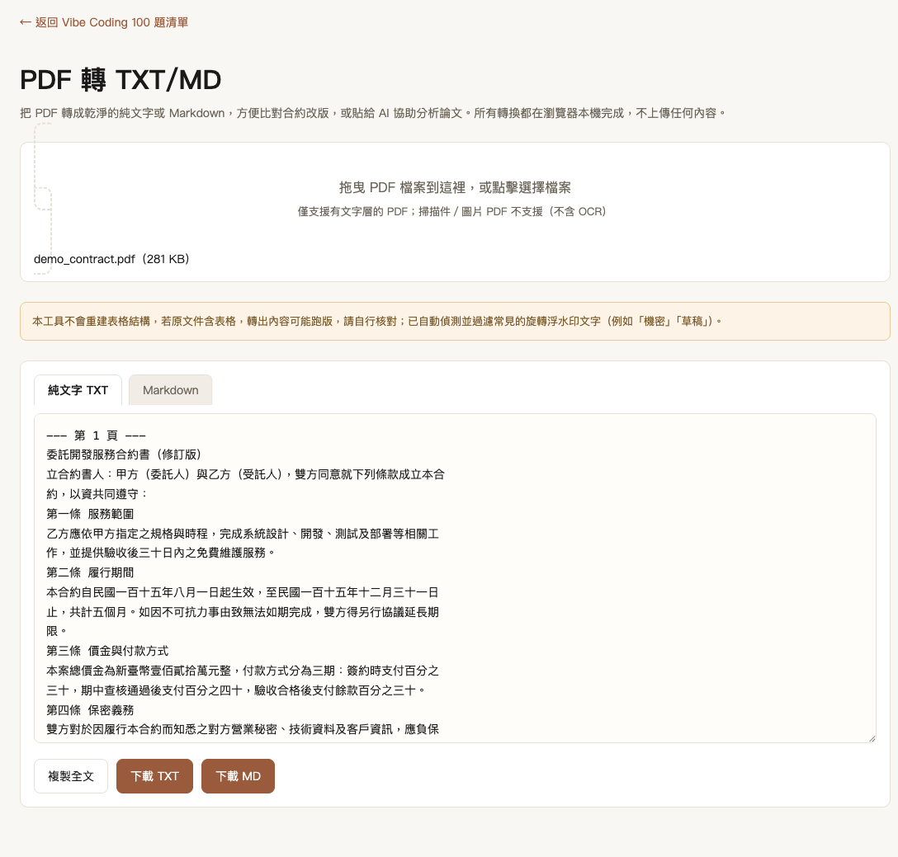
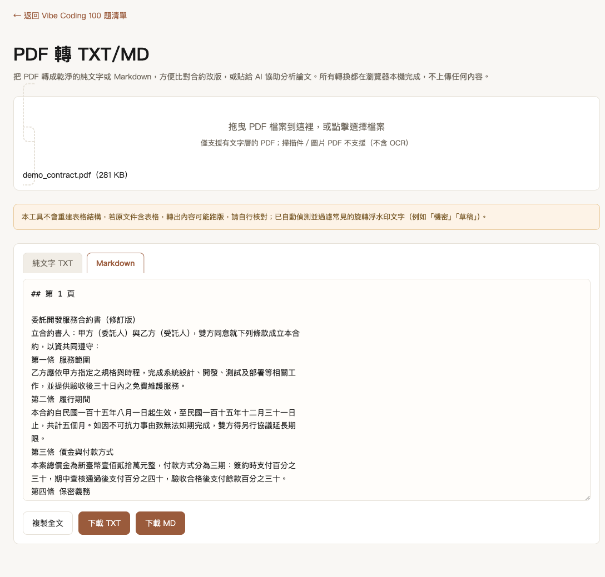

# Day 2：PDF 轉 TXT/MD，先幫 AI 把雜訊濾掉再說

> 🔀 **本內容原編號 Day2，因系列重新分類移至現在的 Day6。**

> 👉 **直接玩玩看**：[PDF 轉 TXT/MD（GitHub Pages）](https://lushinshang.github.io/2026ironman/VibeCoding/Day6/index.html) ・ [原始碼](https://github.com/lushinshang/2026ironman/tree/main/VibeCoding/Day6)

**目錄**
[1. 情境](#1-情境) · [2. 解題思路](#2-解題思路) · [3. 資源](#3-資源) · [4. Vibe 過程](#4-vibe-過程) · [5. 產品](#5-產品) · [6. 心得與反思](#6-心得與反思)

---

## 1. 情境

廠商寄回來的合約修訂版是一份 PDF，不是 Word。想比對這一版跟上一版到底改了哪幾句，第一步就卡住：PDF 沒辦法直接拿去做逐字比對，複製貼上又常常斷行斷得亂七八糟、字跟字之間黏在一起，得先手動清理才能真正拿去比對。

另一個情境更常見：把論文 PDF 丟給 AI 助理讀。PDF 是版面格式，裡面帶著座標、字型、圖層這些跟內容無關的資訊，AI 解析同一段文字要吃掉的 token 遠比純文字多，還很容易把頁碼、浮水印這類版面雜訊當成內容一起塞進 context，稀釋重點、增加幻覺風險。先轉成乾淨的 TXT/MD 再餵給 AI，才是正確的順序。

這是 Vibe Coding 系列的第二天，也是刻意設計的第一步：Day2 先把 PDF 轉成乾淨文字，轉出來的結果會直接餵給 Day3 的文字差異比對器，兩篇文章的情境會前後呼應。

## 2. 解題思路

Day1 的字數統計器可以做到「零外部套件」，Day2 一開始就知道做不到——瀏覽器原生沒有解析 PDF 二進位格式的能力，唯一可行的路是內嵌 Mozilla 的 pdf.js。這是本系列少數不追求「絕對輕量單檔」的例外，取捨原因在 PRD 裡就先寫清楚：檔案會明顯變大，換來的是不用伺服器、PDF 內容不離開瀏覽器。

流程沿用 Day1 的 SDD 三階段，但規模照 `CHECKLIST.md` 的規則壓縮——精簡版 PRD、proposal 塞 ASCII wireframe 不另開設計文件、tasks 拆成可勾選的小任務：

MVP 範圍也明確劃線：只做「擷取文字層」，不做 OCR（掃描件另外處理）、不重建表格欄位結構（依 pdf.js 原始閱讀順序輸出，UI 提示可能跑版）、不處理非旋轉的半透明浮水印。範圍寫死在 PRD 的 Out of Scope，不是做到一半才想到要收斂。

## 3. 資源

- **Claude Code**：同 Day1，走 SDD 三階段——提案、實作、歸檔
- **pdf.js（Mozilla 官方函式庫）**：唯一內嵌的第三方套件，負責解析 PDF 文字層與座標資訊
- **esbuild**：把只有 ES Module 格式的 pdf.js 打包成可用的型態，過程中還要手動處理 top-level await
- **PRD.md / proposal.md / tasks.md**：11 條任務，逐條完成才進下一步
- **Puppeteer**：這次沒有用 Playwright MCP 的互動介面，改直接寫腳本對 `file://` 開啟的頁面做自動化操作與 Network 請求監聽
- **一支獨立的 fresh agent**：不知道前面實作細節，自己重新產生測試 PDF、自己寫測試腳本，驗收 7 條標準

## 4. Vibe 過程

### 打包 pdf.js：三個坑，三種解法

第一個坑最基本：pdf.js 官方發行版只有 ES Module（`.mjs`）格式，沒辦法直接塞進 `<script>` 標籤。用 esbuild 打包成 IIFE 又直接編譯失敗，因為原始碼裡有 top-level await——這種寫法只在模組層級合法，包成傳統函式格式就不成立了。解法是先打包成 ESM，再手動剝掉結尾的 `export {...}`，把整段程式碼包進 `(async function(){ ... })()`，讓 top-level await 變成函式內部合法的 await，靠原始碼裡本來就有的 `globalThis.pdfjsLib = await (...)` 這行完成全域曝露。

第二個坑是實際打開瀏覽器才炸出來的：主檔打包完看起來沒問題，真的上傳 PDF 測試才跳出 `Setting up fake worker failed: Cannot read properties of undefined (reading 'setup')`。追進 pdf.js 原始碼才發現它內部寫死用 `new Worker(url, { type: "module" })` 建立背景執行緒，跟我們把 worker 包成傳統 IIFE 格式完全對不上。既然 pdf.js 堅持要 module worker，乾脆把 worker 也打包成 ESM（保留 `export`），透過 Blob URL 建立——Blob URL 是瀏覽器內部產生的同源資源，不會被 `file://` 協定對外部 script 模組載入的限制擋下來。這條路徑用 Puppeteer 直接對 `file://` 開啟的頁面實測上傳 PDF，確認真的能解析出文字，不是只憑推論改完就結案。

第三個坑跟浮水印判斷有關：浮水印通常每頁重複出現，但頁首頁尾（頁碼、公司抬頭）也是每頁重複，光看「重複次數」會把合法的頁首頁尾一起濾掉。多加一個角度條件就解決了——典型浮水印幾乎都是斜的（30°～45°），頁首頁尾幾乎都是水平（角度 0）。規則變成「同一字串在 ≥ 80% 頁面重複出現，且文字旋轉角度不為 0」才判定為浮水印：

這條規則做完之後，另外做了一份「非旋轉、重複頁首頁尾」的測試 PDF 去驗證不會誤殺正常內容，而不是只測正向案例就收工。

11 條任務全部做完，一樣不接受自己驗自己：派一支完全不知道前面實作細節的 fresh agent，只給規格文件跟驗收條件，agent 自己重新產生測試 PDF（一般 PDF、中英文旋轉浮水印、表格、無文字層、非旋轉頁首頁尾邊界情境）、自己寫測試腳本，7 條驗收條件全數 PASS。資安檢測也照 Day1 的方法做一輪：我方程式邏輯無 `innerHTML`、無外部請求；pdf.js 本身雖然具備遠端載入 PDF、下載字型資料的網路能力，但確認呼叫方式固定傳入本機 `ArrayBuffer`（不是 URL），也沒設定會觸發字型下載的選項，另外用 6 組不同 PDF 搭配 Puppeteer 監聽全部網路請求驗證，每一組對外請求數皆為 0，跟程式碼靜態分析結論一致，詳見 `Day2/SECURITY_REVIEW.md`。

### 驗收後才炸出來的真實案例：中文字被硬塞空格

工具通過驗收上線後，用一份真實的政府採購案 PDF 實測，才發現轉出的中文內容每個字之間都被硬塞了空格（「大 氣 海 洋 局」這種樣子），英文句子倒是正常。原因是同一行的文字物件原本一律用空格拼接（`.join(" ")`），但很多 PDF——尤其中文字型——會把每一個中文字存成獨立的文字物件，不能假設「不同物件之間就該有空格」。

解法改成比對「前一個字結尾座標」跟「下一個字開頭座標」的實際間距，間距超過字級大小的 0.3 倍才插入空格，否則直接接在一起——這是 pdf.js 文字重建的標準做法。額外做了一份「每個中文字都是獨立文字物件、緊密排列」的測試 PDF 重現問題，並重跑先前所有回歸測試（一般 PDF、中英文浮水印、表格、無文字層、頁首頁尾邊界情境）確認沒有破壞既有功能。改完之後，中文緊密排列不再有多餘空格，英文單字間的正常空格也保留正確。

這個案例也印證了 fresh agent 用「合成測試 PDF」驗收有它的局限——合成資料再仔細設計，也不見得覆蓋得到真實世界 PDF 的所有排版怪癖，跟使用者拿真實文件實測是兩件事，兩者都需要。

### 同一份 PDF 又炸出第二個坑：全形空白沒清乾淨

CJK 間距的坑修完、上線又跑了一陣子後，使用者拿同一份真實政府採購案 PDF 追問一句：「空白處有移除嗎？（半形或全形）」。回頭看負責清理空白的那行程式碼，正規式是 `.replace(/[ \t]+/g, " ").trim()`——只列了半形空白（ASCII space）跟 tab，完全沒提到全形空白（U+3000　）。

有意思的地方在於，字串「頭尾」的全形空白其實不會漏網：JavaScript 的 `.trim()` 對 whitespace 的定義涵蓋 Unicode 的 `Space_Separator` 分類，全形空白剛好在裡面，所以行首行尾會被順手清掉。但字串「中間」的全形空白完全不歸這行正規式管，只要 PDF 內文用了全形空白排版（政府公文常見），轉出來的 TXT 就會原封不動留著。這種「頭尾有效、中間漏接」的半吊子行為，光看程式碼很容易被表面上「有 trim 就沒事」的直覺唬過去，實際跑一行 Node.js 單元測試才現形。

使用者確認要把中間的全形空白也當雜訊清掉，正規式改成 `.replace(/[ \t　]+/g, " ").trim()`，多納入這一個字元。改完不是自己說「應該修好了」就結案：請使用者重新在瀏覽器操作一次，把同一份真實 PDF 的轉換結果下載成檔案，再對這份近 500KB 的真實輸出跑三項 `grep` 檢查（全形空白數量、連續半形空白行數、行首尾殘留空白行數），三項都是 0；還額外比對了程式碼跟輸出檔案的修改時間，確認這份結果真的是修正後才產生的，不是拿舊版程式碼跑出來的結果矇混過關。

### 同一份 PDF 又炸出第三個坑：藏在 annotation 圖層裡的文字

使用者拿同一份 PDF 又問了一句：「是不是每一頁都有那行密等標示？」先用 `grep` 統計自家輸出的頁碼分布，發現規律很整齊——但這只證明「輸出內部一致」，沒證明「輸出跟原始 PDF 一致」。換一套完全獨立的解析引擎（系統內建的 `pdftotext`）重新擷取一次原始 PDF，逐頁交叉比對 252 頁，找到唯一一頁不一致：第 234 頁，`pdftotext` 抓得到那行字，自家工具沒抓到。

用瀏覽器直接偵錯 pdf.js 在這一頁回傳的原始資料，`getTextContent()` 確認內容流裡真的沒有這段文字的物件；改呼叫 `getAnnotations()` 才發現，這一頁的密等標示是用 `FreeText` annotation（後製貼上去的圖層）呈現的，不是頁面正文——它剛好是另一份附件文件被合併進這份大 PDF 時帶進來的。工具原本只呼叫 `getTextContent()`，這個 API 設計上不含 annotation 內容，系統性地漏掉這一類頁面。

一開始評估這要處理「annotation 文字該插在閱讀順序哪個位置」「怎麼過濾掉簽名框、註解框等非文字 annotation」，覺得複雜度不低，先當已知限制記錄下來、沒有動手改。但實際檢查 `getAnnotations()` 回傳的資料後發現，pdf.js 早就把 annotation 的顯示文字解析好放在 `contentsObj.str` 裡，不用自己去解析 annotation 的繪圖指令——複雜度比一開始評估的低很多，這個判斷後來被推翻，改成動手修。

解法是把符合條件的 annotation 換算成跟一般文字物件相容的座標格式，依 y 座標插入到既有文字陣列裡正確的位置，沒有 annotation 的頁面完全不受影響。改完一樣用真實的 252 頁 PDF 重新跑一次，兩項交叉驗證：跟 `pdftotext` 逐頁比對零不一致；除了補上的那一頁，其餘 251 頁輸出跟修正前逐字比對完全相同，證明沒有動到既有的正確行為。

### 一段插曲：一次沒有經過確認就下的指令

使用者實測時回報「開啟這個 HTML 檔案本身就卡住」。排查過程中，AI 誤下了一個嘗試關閉使用者 Chrome 的指令——所幸當下環境本來就沒有 AppleScript 自動化授權，指令實際上沒有生效，使用者的分頁沒受影響，但這仍是一次沒有先確認就執行有風險操作的失誤。同時發現先前測試腳本遺留了好幾個沒關乾淨、各自佔用 CPU 時間的背景無頭瀏覽器程序，清除後使用者回報問題消失。這個因果關係沒有經過嚴謹驗證，比較合理的推測是系統資源被殘留程序占用，但不誇大成「已解決根因」——這件事直接記錄在 `Day2/README.md` 裡，不因為結果看起來沒事就當沒發生過。

### 補兩個功能：過濾紀錄可回查、單一 HTML 離線下載

前面幾個坑都是「上線後才發現」的被動修正，這次換成主動提需求：過濾掉的內容要能事後查證（浮水印跟頁首頁尾濾掉的到底是什麼、在哪幾頁），還有比照 Day1 支援存成一份不依賴外部連結的離線版本。這兩個是正常大小的新功能，照專案既有的 SDD 流程走：先寫 proposal 定義範圍、拆成 8 條一小時內能做完的任務、使用者確認後才動手，每條做完就跑測試、打勾、簡短回報，不是悶頭做完 8 條才一次回報。全部做完後，派一支完全沒看過實作過程的全新 agent 獨立驗收——不能自己驗自己，同一個脈絡裡很容易對自己的假設視而不見。

驗收全部通過，過濾紀錄下載出來的內容跟真實 PDF 的已知答案（125 頁精準比對）完全一致。事情看起來到這裡就結束了。

### 第四個真實案例：連驗收都沒測出來的 bug

驗收過關後，使用者多提一個小要求：下載出來的獨立 HTML 裡面，不要再包含「下載本工具」這顆按鈕本身（不然變成下載出來的東西又能再下載一次自己，沒必要）。這是個很小的改動——把這顆按鈕從複製出來的 DOM 裡移除掉就好，改完也實測過：原頁面按鈕還在、下載複本裡按鈕跟外層容器都乾淨移除，看起來天衣無縫。

結果使用者下一句話是：「下載後的單一 html，拖曳 pdf 進不去。」

追下去才發現，刪掉按鈕的同時，忘了程式碼裡還有一行專門綁在這顆按鈕上的事件監聽器沒有加防呆。下載複本裡這個按鈕已經不存在，那行程式碼執行到一半直接丟出例外，把整段 `<script>` 的執行**攔腰截斷**——JavaScript 是照順序往下跑的，一行沒接住的錯誤會讓寫在它後面的所有程式碼全部沒機會執行，包括看起來完全不相關的拖曳事件監聽器。功能測起來正常，是因為從沒走到那條真正會出事的路徑。

更值得記一筆的是「為什麼驗收沒抓到」。回頭看，不管是我自己測試還是 fresh agent 驗收，全程都是用「直接把檔案塞進 `<input>` 元素、觸發一個 change 事件」的方式模擬上傳——這是最方便寫測試的做法，但也完全繞過了使用者實際會用的拖曳互動路徑。驗收條件寫的是「PDF 能不能成功轉換」，這個條件本身沒有錯，但驗證它的手段剛好避開了會出事的那條路。修好之後，這次改用真正的拖放事件去觸發，而不是走捷徑模擬，才真正驗到問題。

用 `if (按鈕存在) { 才綁事件 }` 補上防呆，修完。這個案例被記錄進專案的踩坑筆記，教訓寫成兩條：刪除一個畫面元素之前，要反向搜尋程式碼裡所有引用到它的地方；測「拖放」這種互動功能，不能只用比較好寫的替代方案模擬，得真的觸發那個互動本身。

## 5. 產品

最後交付的是一個內嵌 pdf.js 的 `index.html`，拖進 PDF 就能拿到乾淨的 TXT 或 Markdown。下圖是實際拖進一份模擬合約 PDF（委託開發服務合約書）後的轉換結果，中文字沒有黏在一起，也沒有多餘空格：

<table>
<tr>
<td width="50%">

**純文字 TXT 模式**

</td>
<td width="50%">

**Markdown 模式**（自動加上頁碼標題）

</td>
</tr>
</table>

功能清單：

- 支援點擊選檔或拖曳 PDF 進入頁面
- 依閱讀順序擷取全文文字，中英文混排間距依實際座標判斷，不會黏字也不會多空格；也會合併頁面上的 `FreeText` annotation 文字（例如公文密等標示），不只抓頁面正文
- 自動偵測並過濾旋轉浮水印文字，保留正常的頁首頁尾內容
- 無文字層（掃描件／圖片 PDF）會顯示明確錯誤提示，不會空白或當機
- TXT／Markdown 兩種輸出格式可切換，一鍵複製、一鍵下載
- 過濾掉的浮水印與重複頁首/頁尾內容可下載成紀錄檔回查，含頁碼範圍（避免密等標示這類敏感內容被拿掉卻查無憑證）
- 支援下載成單一 HTML 離線使用，不依賴外部連結，拖曳互動與所有功能完整保留
- 轉換過程全程在瀏覽器本機完成，Network 面板零對外請求；`file://` 雙擊開啟也能正常運作

已知限制（如實列出，不迴避）：

- 表格不重建欄位結構，依 pdf.js 原始閱讀順序輸出，跑版時 UI 會提示人工核對
- 本機沒有 GUI 自動化權限測 Safari、也沒有安裝 Edge，只完成了 Chrome 的完整自動化互動測試
- 複製到剪貼簿在 headless 測試環境下會因瀏覽器沙盒限制回報失敗，但程式碼本身有 feature-detect 與例外處理，屬正常的優雅降級

**線上體驗**：[lushinshang.github.io/2026ironman/VibeCoding/Day6](https://lushinshang.github.io/2026ironman/VibeCoding/Day6/index.html)
**原始碼**：[github.com/lushinshang/2026ironman](https://github.com/lushinshang/2026ironman/tree/main/VibeCoding/Day6)

## 6. 心得與反思

Day2 最有價值的收穫不是「PDF 轉文字」這個功能本身，是那四個陸續炸出來的案例——中文字被硬塞空格、全形空白沒清乾淨、annotation 圖層的文字漏抓、刪按鈕漏改事件監聽器讓拖曳整個失效。工具在 fresh agent 的獨立驗收裡拿到全過，看起來已經是「做完了」，結果一次又一次被同一份使用者真實丟進來的政府採購案 PDF、或使用者接下來一句簡單的追問，現形驗收沒測到的問題。驗收條件寫得再仔細、合成測試資料設計得再周全，覆蓋的終究是「已經想到要測的情境」，跟「使用者實際會怎麼用」永遠有落差。這不是驗收流程失敗，而是提醒自己：獨立驗收跟真實案例測試是兩層不同的保險，缺一層都不夠，而且同一份真實資料反覆用、反覆問，還是能挖出新問題。第三個案例還多提醒一件事：一開始評估「太複雜先不修」的判斷，實際動手查證後可能會被推翻——覺得麻煩之前，先花五分鐘看看 API 到底回傳什麼，比憑印象評估工程量可靠。

第四個案例則是更深一層的提醒：驗收方法本身也可能有盲點。為了方便測試，很自然會找「效果等價但比較好模擬」的替代方式去驗證一個互動功能，但如果那個替代方式剛好繞過了真正容易出事的那條程式碼路徑，驗收全過也只是「證明了替代路徑是好的」，不是「證明了使用者實際會走的那條路是好的」。這比「沒寫測試」更難察覺，因為表面上測試齊全、還通過了獨立驗收，卻仍然漏掉了問題——寫驗收條件時，多問一句「我驗證的手段，走的是使用者真的會走的那條路嗎」，值得成為固定的檢查習慣。

另一件事是那次誤下的關閉瀏覽器指令。結果上沒有造成任何影響，純粹是環境剛好沒有授權擋下來，但這種「這次沒事」不能被當成「這樣做沒問題」，如實記下來就是為了不讓自己下次心存僥倖。

30 天走到第二天，Day1 打的底子——先寫清楚規格、真的動手測、不自己驗自己——這次多驗證了一次：規則要能撐住比預期更真實、更髒的輸入，才算真正立得住。
