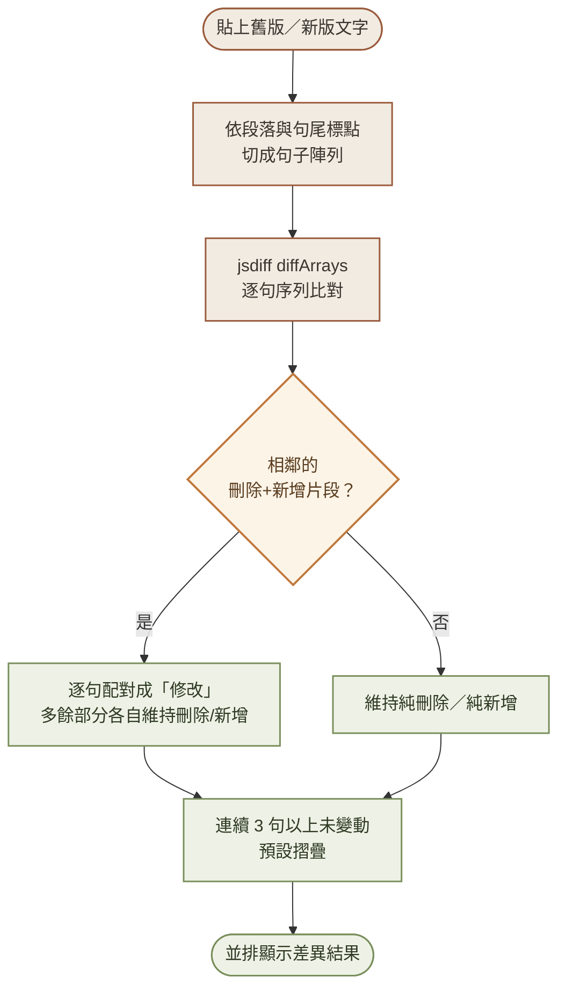
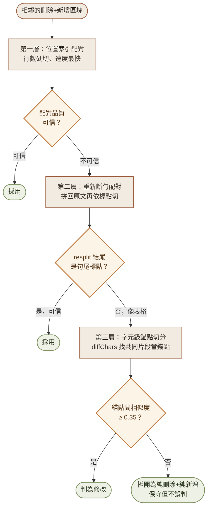
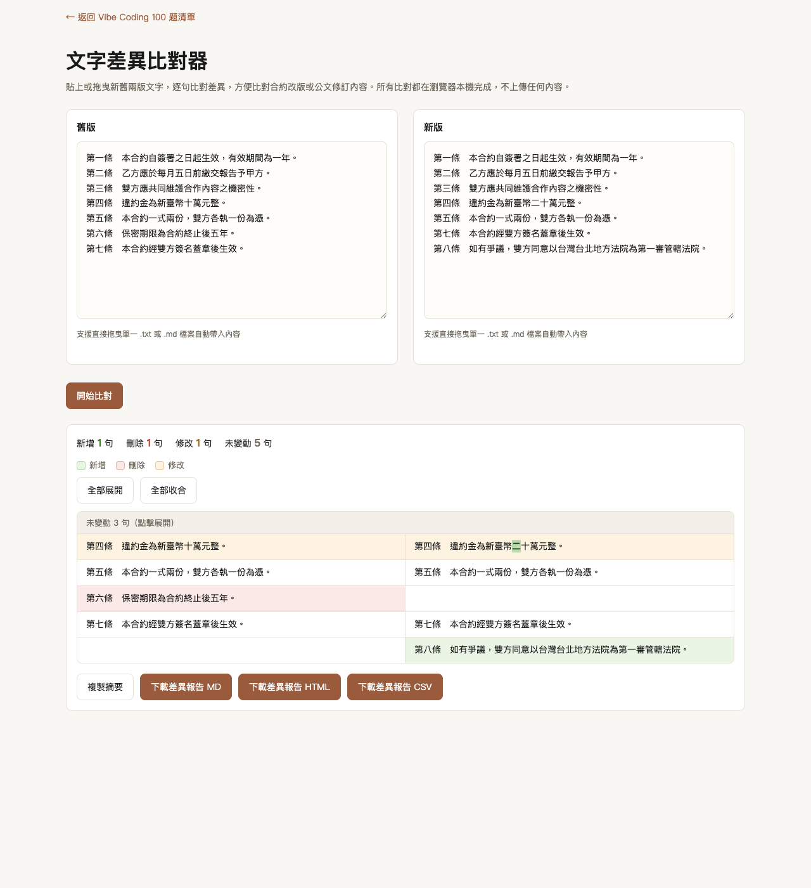

# Day 3：文字差異比對器——合約改版比對的最後一哩路

> 🔀 **本內容原編號 Day3，因系列重新分類移至現在的 Day7。**

> 👉 **直接玩玩看**：[文字差異比對器（GitHub Pages）](https://lushinshang.github.io/2026ironman/VibeCoding/Day7/index.html) ・ [原始碼](https://github.com/lushinshang/2026ironman/tree/main/VibeCoding/Day7)

**目錄**
[1. 情境](#1-情境) · [2. 解題思路](#2-解題思路) · [3. 資源](#3-資源) · [4. Vibe 過程](#4-vibe-過程) · [5. 產品](#5-產品) · [6. 心得與反思](#6-心得與反思)

---

## 1. 情境

廠商把合約修訂版寄回來了，附一句話：「已依貴方意見修改三處條款。」

打開舊版、開啟新版，兩份都是 15 頁的密密麻麻條文，肉眼對照第一段還算輕鬆，對到第八頁已經開始跳行——漏看一句加了但沒刪的舊條款、看錯一個「不」字被拿掉，這種事每次逐字核對都可能發生。等真的簽下去才發現改的不只三處，麻煩已經來不及回頭。

這是 Day2「PDF 轉 TXT/MD」的下一步。Day2 把公文 PDF 轉成乾淨的純文字，這裡接手：貼上舊版、貼上新版，直接看出哪些句子被刪、哪些是新增、哪些改了字——不用再一行一行核對，改動之外的段落也不用逐字重讀一次。

## 2. 解題思路

工具本身要解決的問題很直白：兩份文字，找出差在哪。但拆開來看，有幾個地方得先想清楚。

要不要自己寫 diff 演算法是第一個坎。Day1 全程零外部依賴，這條路線放到這裡卻不成立——LCS／Myers diff 的邊界情況（空輸入、整段刪光、句數不等長）多到自己刻出來很難跟現成函式庫一樣穩，硬要手刻反而把力氣花在錯的地方。動手前先用 `npm pack diff@5` 實際下載套件、打開 `dist/diff.js` 檢查，確認它是標準瀏覽器 UMD bundle，直接掛在 `global.Diff`，沒有 Day2 那個 pdf.js ESM-only 又要另外處理 Worker 的相容性問題——內嵌起來單純很多，於是在 PRD 階段就定案「內嵌 jsdiff」，不是每天都要重新驗一次零依賴的教條。

演算法定案後，斷句規則才是真正麻煩的地方。jsdiff 的 `diffArrays` 只會告訴你「這句刪了、那句加了」，句子怎麼切、切多細，決定了使用者看到的差異顆粒度合不合理。規則定成先依空行分段，段落內再依中文句尾標點（。！？；）切句，沒有標點的整段就當一句——聽起來簡單，但真實文件裡表格、清單這類沒有句尾標點的內容，會把這條規則逼到極限，這部分後面會反覆出現。

斷句定案，接著要面對「修改」這個概念哪裡來的。jsdiff 原生只有新增、刪除兩種結果，沒有「修改」——但使用者真正想看到的是「這句話被改寫了」，不是「舊的那句被刪掉，然後新的一句被加進來」。規則定成：連續的刪除片段後面緊接著新增片段時，兩邊逐句配對成「修改」，多出來的部分各自維持純刪除或純新增。這條規則寫完立刻拿三組對應 PRD 驗收條件的案例驗證（3 處修改、新版多一整段、新版少一整段），確認 jsdiff 的序列比對不會把「順序沒變、中間刪一句」這種情況也誤判成修改。

未變動區塊要不要摺疊也定了個具體門檻：連續 3 句以上才摺，摺起來顯示「未變動 N 句」可以點開；1～2 句太短，摺了反而畫面更破碎。這幾個決策定案後，才進入 SDD 流程的提案階段。

## 3. 資源

- **jsdiff**：內嵌的第三方函式庫，負責 `diffArrays` 序列比對與 `diffChars` 字元級差異，是 Day3 少數不追求「絕對零依賴」的例外
- **Playwright MCP**：測互動邏輯用，也拿來繞過 `file://` 協定被擋的限制——先起本機伺服器讓自動化走 `http://127.0.0.1`，再用 `browser_evaluate` 直接對斷句、比對這些純函式灌測試資料，逐項核對輸出
- **codex exec**：獨立於主要開發流程之外的第二個驗收管道，專門拿來做「對抗式測試」——不是重新跑一次既有測試案例，是主動找漏洞、給出可重現的反例
- **Opus 5 fresh agent**：另一個獨立驗收管道，動態測試比對邏輯的正確性，多輪修正裡有兩輪是靠它抓到自己沒發現的漏洞
- **PRD.md / proposal.md / tasks.md**：SDD 三階段的骨架，每一輪追加修正（後面會提到的 6 輪）都各自走完一次提案→實作→驗收

## 4. Vibe 過程

SDD 九條任務照規格做完，Playwright 對每個功能實際操作驗證，派 fresh agent 獨立驗收——七條驗收條件全過。照流程走到這裡本來可以收工了。

拿一份約 280 頁的真實政府採購案 PDF（用 Day2 的工具轉出）貼進去實測，畫面跳出來的數字是「新增 6650／刪除 1005／修改 2421／未變動 1088」。四千頁文件的規模才會有這種數字，這是一份 280 頁的合約。統計數字本身沒有算錯，錯的是「什麼該被算進差異」這件事，跟 PRD 驗收條件裡那幾個乾淨的測試案例（3 處修改、多一段、少一段）完全是兩個世界。

派一支背景 agent 專門對這份異常輸出做分類，不是重新驗證邏輯對不對，是回答「這幾千筆差異裡，真正是差異的有幾筆」。分類結果：頁碼標記污染、不相關句子被硬配對成修改、PDF 抽字空白不一致、斷句顆粒度不一致（佔比最大）、缺乏字元級標示——五類問題，估計「修改」欄位裡大概 82～90% 是雜訊，不是真的差異。這個數字才是真正的起點：先前的驗收全過，驗證的是「邏輯設計對不對」，沒驗證過「碰到真實世界的排版噪音會怎樣」。

第一輪修正處理最明顯的四類：過濾頁碼標記、比對前先正規化（只影響判斷、不影響畫面顯示的文字）、bigram 相似度低於門檻就拆回純刪除新增（不硬湊成修改）、加上字元級標示讓「修改」看得出具體改了哪幾個字。過程裡自己抓到一個 jsdiff 顯示邏輯的小 bug：未變動列的內容永遠只取新版陣列的值——邏輯上沒差（兩邊內容本該相同），但抓到就順手修掉。這輪修完，「修改」數從 513 腰斬到 246。

真正有意思的是後面幾輪：每一輪找到的問題，起點都不是「我又想到一個邊界情況」，是某個真實案例逼出來的。有一次是舊版某段條文跟新版幾乎一樣，只因為兩份 PDF 排版寬度不同、換行位置不一樣，就被嚴格位置配對誤判成「大量刪除+大量新增」——這種問題在乾淨的測試案例裡永遠不會出現，因為測試案例的斷行本來就整整齊齊。改成偵測到相鄰的刪除+新增區塊時，額外重新拼回原始文字再斷句一次，兩種配對結果取比較準的那個。這條邏輯派 `codex exec` 當獨立驗收，不是重跑一遍我寫的測試，是專門找漏洞——第一輪就抓到新舊配對「打平」時邏輯選錯了邊（原本該用新結果，寫成保留舊的），第二輪給了一個更刁鑽的案例：在表頭塞一個「；」，剛好繞過我當時設的防護條件。兩次都改好、也都用 codex 給的案例重新驗證通過，才算真的補上這個洞。

還有一輪是使用者自己看下載出來的 CSV 抽查文件時發現的：某段條文一部分項次完全沒變、一部分項次真的被大改，混在同一個差異區塊裡，前面幾輪修正都沒能處理這種「部分相同部分不同」的情況，整段照樣被判成不相關的大量刪除加大量新增。這次委託 `codex exec` 只做分析、不動手實作，拿到方向後自己寫，改用字元級 diff 找出區塊裡足夠長的共同片段當「錨點」，錨點之間才是真正的差異。這條邏輯上線前，換 Opus 5 的 fresh agent 做動態驗收（因為 codex 那次連續兩次連不上瀏覽器環境）——抓到一個「相似度灌水」漏洞：兩段完全不相關的內容（伺服器規格表 vs 防水工程說明）因為都被算進同一組相似度分母，數字被稀釋到超過門檻，照樣被誤判成修改。改成只用真正的差異部分計算相似度後才修好。

最後一輪是使用者自己提出方向的：先把換行造成的空白差異正規化掉、記住原始位置，比對完再映射回去顯示。這個提案後來被證實是抓到了好幾輪問題的共同根因，不是頭痛醫頭。同一輪還把「resplit 結果可信不可信」的判斷從粗糙的「元素數量」門檻，改成看有沒有正確用句尾標點收尾——這個線索是既有的斷句函式本來就會保證除了最後一段之外都在標點處收尾，等於白撿一個現成的信任判準，不用另外發明規則。Opus 5 的獨立驗收又抓到兩個問題：空白正規化的邊界字元在拼接時憑空消失（英文單字黏在一起）、以及正規化去得太乾淨導致「1 2 3」跟「123」被誤判成完全相同。兩個都修好，重新驗證過既有的回歸案例。

六輪修正下來，沒有一輪是「一次到位」——每一輪上線前的獨立驗收（`codex exec` 或 Opus 5 fresh agent）幾乎都抓到至少一個自己沒發現的問題，這個模式重複到第三、第四次之後，已經不覺得意外，反而變成一種習慣性的預期：改完不會覺得「這次應該沒問題了」，而是直接想「這次獨立驗收大概會抓到什麼」。

這幾輪修正疊起來，其實是一套三層 fallback 架構：第一層位置索引配對最快但最脆弱，配不好就交給第二層重新斷句配對，兩層都失敗（通常是規格表這種沒有語意邊界的內容）才會用到第三層字元級錨點切分——越後面的層級越保守、越花算力，但也越不容易配錯：

也留下兩項誠實記錄、沒有硬修到底的已知限制：一種是規格表這類沒有語意邊界可切的內容，機械式切塊配對出來的結果不夠精準（體驗瑕疵，資料不會遺失，跟使用者討論後決定接受這個取捨，不追加更大範圍的語意邊界重構）；另一種是同一差異區塊裡如果有兩個以上真正不同的位置互相交錯干擾對齊，目前架構仍可能配對不準，需要更大幅的重構才能根治，留待後續評估。

## 5. 產品

最後交付的是一個內嵌 jsdiff 的 `index.html`，貼上舊版新版文字（或直接拖曳 .txt/.md 檔案），按下比對，立刻看出改了哪裡。下圖是實際貼進一份模擬合約條文後的比對結果——新增的第八條標綠、刪除的第六條標紅、金額被改的第四條逐字元標色，三句未變動的條文自動摺疊成一行：

<table>
<tr>
<td width="50%">

**桌面版**（新增/刪除/修改分色標示，未變動區塊摺疊）

</td>
<td width="50%">

**手機版**（375px 寬，輸入區改為單欄堆疊；差異結果表格因為要維持左右對照，仍保留雙欄，會比桌面版窄）

</td>
</tr>
</table>

功能清單：

- 左右兩欄貼上舊版／新版文字，或直接拖曳 .txt／.md 檔案自動帶入
- 逐句比對，標出新增、刪除、修改（修改的句子額外用字元級標色，看得出具體改了哪幾個字）
- 連續 3 句以上未變動自動摺疊，可個別展開或一鍵全部展開／收合
- 差異統計摘要（新增／刪除／修改／未變動各幾句），一鍵複製摘要文字
- 下載差異報告，支援 Markdown、獨立離線 HTML、UTF-8 BOM 的 CSV 三種格式
- 全程零外部請求，比對邏輯全部在瀏覽器本機執行

已知限制（如實列出，不迴避）：

- 規格表這類沒有語意邊界（無句尾標點、無固定欄位分隔）的內容，差異切分是機械式切塊，配對不一定精準對應語意邊界，但資料不會遺失
- 同一差異區塊裡若有兩個以上真正不同（非排版問題）的位置互相交錯干擾對齊，目前架構仍可能配對不準，需要更大幅的重構才能根治
- 手機版的差異結果表格仍是左右雙欄對照，不會像輸入區那樣收成單欄，窄螢幕上會需要橫向捲動

**線上體驗**：[lushinshang.github.io/2026ironman/VibeCoding/Day7](https://lushinshang.github.io/2026ironman/VibeCoding/Day7/index.html)
**原始碼**：[github.com/lushinshang/2026ironman](https://github.com/lushinshang/2026ironman/tree/main/VibeCoding/Day7)

## 6. 心得與反思

Day3 跟 Day1、Day2 最大的不同，是「驗收全過」跟「真的能用」之間的距離拉得特別長。九條任務、七條驗收條件全過，那個當下感覺已經做完了；真正的工作量其實是接下來六輪——每一輪都是先被一份真實文件打臉，才知道自己漏了什麼。合成測試案例永遠只會驗證「我想到的情境」，280 頁的真實公文永遠會補上「我沒想到的情境」，這件事在 Day2 就發生過一次，這次又發生了，而且發生了六次。

比較特別的是這次多了 `codex exec` 這個角色。之前的獨立驗收多半是給一份規格跟驗收條件，讓 fresh agent 重跑一遍測試；`codex exec` 好幾輪扮演的是另一種角色——不是驗證「規格有沒有做到」，是主動找漏洞、給反例，抓到的問題往往是我自己不會特意去想的攻角（表頭塞一個標點符號就能繞過防護、判斷式打平時邏輯選錯邊）。同一個問題，「照著測試案例跑一遍」跟「有意識地想辦法讓你出錯」找到的東西完全不一樣，這次算是真正體會到兩者的差別。

也有一次是使用者自己提出方向、後來被驗證是對的——不是工具設計者永遠是最懂問題的人，有時候換一個角度看同一批真實案例，反而先看出幾輪修正背後的共同根因。這提醒了一件事：獨立驗收找漏洞很重要，但方向對不對，有時候需要跳出「繼續修下一個症狀」的循環，退一步看這些症狀是不是同一個病。

最後留下的兩項已知限制，沒有硬做到底，是刻意的決定，不是放棄。單一 HTML、零依賴是整個系列的架構前提，語意邊界偵測需要處理的格式變體（全形半形編號、多層清單、跨欄位表格）複雜度會直接超出目前純函式的規模，而且沒有 DOM 結構可以借力。把這條線畫清楚、誠實記在文件裡，好過為了「看起來全部解決了」硬凹一個脆弱的解法。
