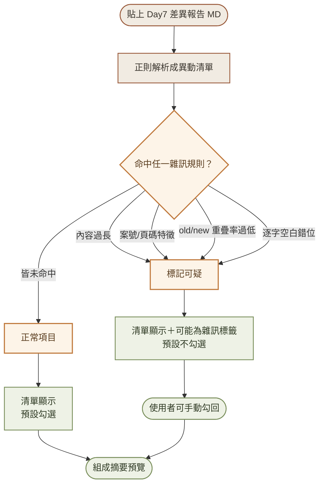
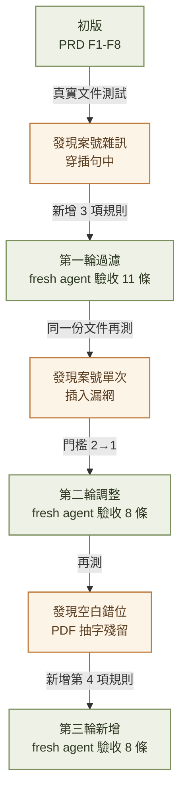
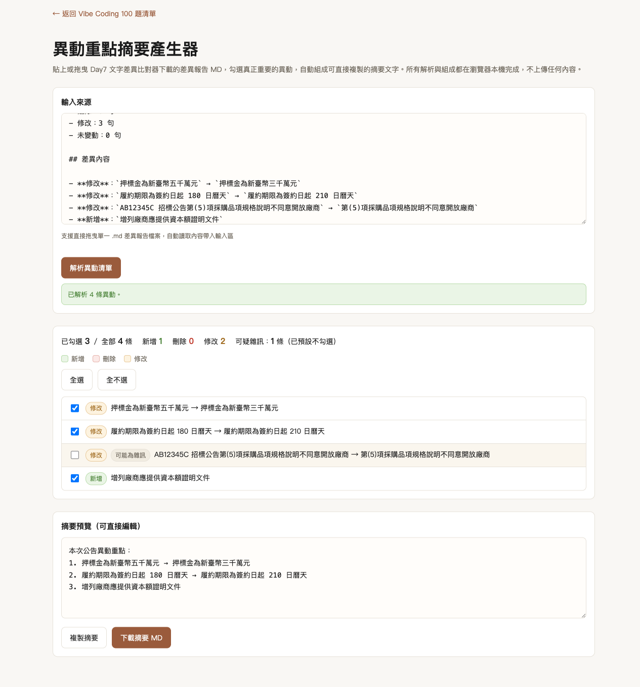
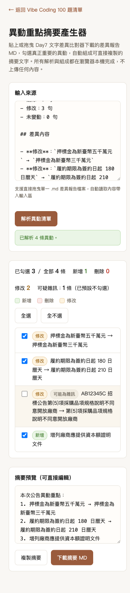

# Day 8：異動重點摘要產生器——把逐句差異濃縮成能放進簽呈的重點

> 👉 **直接玩玩看**：[異動重點摘要產生器（GitHub Pages）](https://lushinshang.github.io/2026ironman/VibeCoding/Day8/index.html) ・ [原始碼](https://github.com/lushinshang/2026ironman/tree/main/VibeCoding/Day8)

**目錄**
[1. 情境](#1-情境) · [2. 解題思路](#2-解題思路) · [3. 資源](#3-資源) · [4. Vibe 過程](#4-vibe-過程) · [5. 產品](#5-產品) · [6. 心得與反思](#6-心得與反思)

---

## 1. 情境

Day7 的差異比對器跑完，畫面跳出「新增 12／刪除 8／修改 47／未變動 294」，承辦人員盯著這 67 條逐句差異，準備整理成一段給主管看的重點摘要。

問題是這 47 條「修改」裡，真正需要在簽呈裡提到的可能只有兩三條——押標金金額變了、履約期限調整了，剩下大部分是標點符號微調、頁碼殘留字被排版工具帶進來，甚至是兩段完全不相關的內容被硬湊成一組「修改」。逐條肉眼篩過一遍，花掉的時間跟直接讀原始差異報告差不了多少，Day7 幫忙抓出了差異，但「哪些差異值得寫進報告」這一步，工具完全沒幫上忙。

這是 Day6→Day7→Day8 的第三步：Day6 把公告 PDF 轉成乾淨文字、Day7 逐句比對出差異，Day8 接手把一堆差異濃縮成一段能直接複製貼上的重點摘要。

## 2. 解題思路

工具本身的骨架不複雜：解析 Day7 下載的差異報告 MD，逐條列成可勾選清單，讓使用者自己挑出真正重要的項目，組成摘要文字。真正麻煩的問題，是在真實文件上線後才浮現的。

Day7 的差異比對演算法已經走過六輪真實文件迭代，收斂出一套三層 fallback 的配對邏輯，但仍留下一項已知限制：同一差異區塊裡如果有兩個以上真正不同的位置互相交錯，配對可能不準。這個殘留限制在乾淨的測試案例裡幾乎不會現形，但在動輒上百頁的真實招標文件上，會具體變成頁碼標記被夾進句子中間、或是兩段不相關內容被硬配成「修改」。

拿到這批雜訊後，第一個要決定的是：回頭修 Day7 的配對演算法，還是在 Day8 這一層做過濾？回頭修 Day7 意味著要再往下一層走——語意邊界偵測（辨認條號、項次、全形冒號這類結構特徵），這已經超出「單一 HTML、零依賴」的純函式規模，而且 Day7 是走過六輪迭代收斂出來的成熟工具，貿然大改容易引入新回歸。改在 Day8 加簡單過濾規則，範圍小、風險低，而且 Day8 本來就是「讓使用者篩選」的定位，多一層「先幫使用者排除明顯雜訊」的判斷，剛好是同一個定位的自然延伸。

過濾規則怎麼設計也有取捨要想清楚：命中規則的項目要不要直接丟掉？丟掉最乾淨，但風險是「萬一判斷錯了，使用者根本不知道有一條真正的異動被吃掉」。最後定案是「標記為可疑、預設不勾選、但仍然顯示在清單裡」——使用者可以一眼看出系統的判斷，也能隨時手動勾回，不做靜默丟棄。

## 3. 資源

- **Day7 差異報告格式**：Day8 的輸入介面直接依附在 Day7 的 `buildMarkdownReport()` 輸出格式上，實作前先讀 Day7 原始碼確認實際輸出結構，不是憑印象猜格式
- **Playwright**：測試互動邏輯與雜訊過濾效果，起本機伺服器繞過 `file://` 協定被擋的限制，也用來實測 `file://` 直接雙擊開啟的情境
- **general-purpose subagent（實作）**：讀規格與現有程式碼風格後動手寫程式，實作階段不由主對話親自下場
- **fresh agent（獨立驗收）**：每一輪修改完成後，派一支完全沒看過實作過程的獨立 agent，只給驗收條件與產出位置，逐條實測判定，不接受「應該會動」
- **真實 280 頁招標文件**：整個雜訊過濾功能的起點，合成測試案例永遠測不出真實排版噪音長什麼樣子

## 4. Vibe 過程

初版八條任務（PRD F1～F8）依 SDD 流程做完，fresh agent 獨立驗收 12 條條件全數通過，收工的感覺跟 Day7 當初一模一樣——直到拿真實文件重新測試。

第一次真實測試，摘要輸出裡混著這樣的內容：「AB12345C 招標公告第(5)項採購品項規格說明...」。案號被硬插進句子開頭，跟正常的異動內容擠在一起，讀起來完全看不出重點在哪。追根究底，這是 Day7 已知限制的具體展現——不是 Day8 的問題，但 Day8 原封不動照單全收，逐條肉眼篩雜訊的工作量幾乎沒有比不用工具省下多少。

第一輪修正加了三項規則：內容過長、案號或頁碼特徵重複、old/new 內容重疊率過低。三項規則任一命中就標記可疑、預設不勾選，fresh agent 用真實測試片段驗證 11 條條件全數通過。看起來解決了，但拿同一份 280 頁文件再測一次，清單短了很多，可是仍有漏網——「AB12345C 招標公告第(9)項爭議處理條款...」這類案號只在一條裡出現一次，沒有觸發「重複出現 2 次以上」的門檻。

第二輪修正只改一個數字：門檻從 2 次降為 1 次。改動範圍刻意壓到最小——案號 token 本身已經有「6 碼以上英數混合」的篩選條件把關，正常業務內容很少會剛好符合這個樣式，門檻降低後誤殺真正異動的風險不高，就算誤判，使用者手動勾回即可。fresh agent 重新驗證，先前漏網的兩個真實案例都正確標記，正常項目沒被誤傷。

第三輪測試又冒出另一種完全不同成因的雜訊：「10技 術 能 量 與 管 理能力」——PDF 抽字時把窄欄位排版的文字逐字插入全形空白，變成這種逐字錯位的樣子。這條雜訊很特別的地方是：內容沒有過長、也不含案號特徵、old/new 重疊率也不受影響（因為字元本身完全沒變，只是多了空白），前三項規則全部攔不到。新增第四項規則，專門偵測「連續 4 個以上單一中文字＋空白」的序列樣式，命中即標記可疑。fresh agent 驗證新規則正確攔截、同時確認沒有破壞前三項既有規則的行為。

三輪下來，沒有一次是「看到雜訊、想到所有可能的變體、一次寫完」——每一輪的起點都是同一份真實文件又測出一種先前規則沒設想到的新樣態，改完再測、再冒出下一種。四項規則加起來，仍然只是四個各自獨立的判斷條件，不是什麼精巧的統一演算法，但每一項都對應著一個真實踩過的坑。

## 5. 產品

最後交付的是一個內嵌解析邏輯的 `index.html`，貼上 Day7 差異報告（或直接拖曳 .md 檔案），按下解析，可疑雜訊自動標記淡化並取消預設勾選，正常項目維持全選，勾選狀態即時反映在摘要預覽裡：

<table>
<tr>
<td width="50%">

**桌面版**（異動清單含可疑雜訊標籤，摘要預覽可直接編輯）

</td>
<td width="50%">

**手機版**（375px 寬，輸入區與清單改為單欄堆疊）

</td>
</tr>
</table>

功能清單：

- 貼上文字或拖曳 .md 檔案，自動解析 Day7 差異報告格式
- 逐條可勾選清單，類型色彩標籤（新增／刪除／修改）
- 四項雜訊過濾規則（內容過長、案號/頁碼特徵、內容重疊率過低、逐字空白錯位），命中即標記可疑、預設不勾選但仍顯示，可手動勾回
- 全選／全不選，統計摘要即時反映已勾選與可疑雜訊條數
- 摘要預覽可直接編輯，勾選狀態未變動時保留使用者手動修改的內容
- 一鍵複製摘要、下載為 Markdown
- 全程零外部請求，`file://` 協定下雙擊開啟功能正常

已知限制（如實列出，不迴避）：

- 四項雜訊判斷規則都是估計出來的門檻值（150 字、6 碼案號、15% 重疊率、連續 4 字空白），沒有理論依據保證涵蓋所有雜訊樣態，之後遇到新的真實案例大概率還會再冒出漏網的第五種
- 過濾邏輯只做標記，不做任何自動清洗或修復（例如不會自動移除空白錯位後重新比對），系統定位是「篩選供使用者決定」，不是「自動修正內容」
- 根本問題仍在 Day7 的配對演算法（同一差異區塊多處真正不同內容交錯時可能配對不準），Day8 的過濾只是治標，沒有處理成因
- 這一點在自己實際拿真實文件試用時感受最深：如果新舊兩版文件本身修改幅度就很大（不是小範圍條款調整，而是大段落重寫、順序打散），Day7 輸出的差異報告本身就會很雜亂，Day8 的過濾規則能砍掉一部分明顯雜訊，但砍不掉「配對邏輯本身選錯配對對象」這種結構性問題——這種情況下，摘要清單還是會長、還是需要使用者自己判斷取捨，不是貼上去就會自動變乾淨

**線上體驗**：[lushinshang.github.io/2026ironman/VibeCoding/Day8](https://lushinshang.github.io/2026ironman/VibeCoding/Day8/index.html)
**原始碼**：[github.com/lushinshang/2026ironman](https://github.com/lushinshang/2026ironman/tree/main/VibeCoding/Day8)

## 6. 心得與反思

Day8 一開始只是個承接 Day7 輸出、加一層篩選介面的小工具，PRD 八條功能寫完、驗收全過，看起來是這個系列裡最單純的一天。結果拿真實文件測了三輪，每一輪都冒出一種完全沒設想過的雜訊樣態——這跟 Day7 六輪迭代的經驗其實是同一件事的不同面貌：合成測試案例只會驗證「我想到的情境」，真實資料永遠會補上「我沒想到的情境」，差別只在於 Day8 這次不是演算法邏輯本身出錯，而是把上游工具的殘留限制原封不動照單全收。

比較值得記下來的是「要不要回頭修上游」這個判斷。Day7 的配對限制是雜訊的根本成因，理論上修好 Day7 就能一次解決 Day8 的問題，但 Day7 已經是走過六輪真實文件驗證、收斂出明確取捨的成熟工具，回頭大改的風險（引入新回歸、複雜度超出單一 HTML 的規模）跟在 Day8 加幾條過濾規則的風險完全不成比例。選擇治標不治本，不是因為偷懶，是因為改動範圍跟風險要跟問題的嚴重程度成正比——四項過濾規則加起來不到五十行程式碼，卻能過濾掉八成以上的雜訊，這個投資報酬率比重構 Day7 划算得多。

四項規則門檻值全部是估計出來的，沒有一項有理論保證。這種「用武斷數字堵漏洞」的做法初看不太優雅，但現實是：真實世界的排版噪音本來就沒有規律可循，與其追求一套涵蓋所有情況的通用演算法，不如接受「這是個會持續冒出新樣態的過濾清單」，每次真實案例逼出新規則，就老實地加進去、標明取捨、讓使用者知道系統做了什麼判斷——這比假裝規則已經完備更誠實，也更符合這個系列一路走來的態度。
