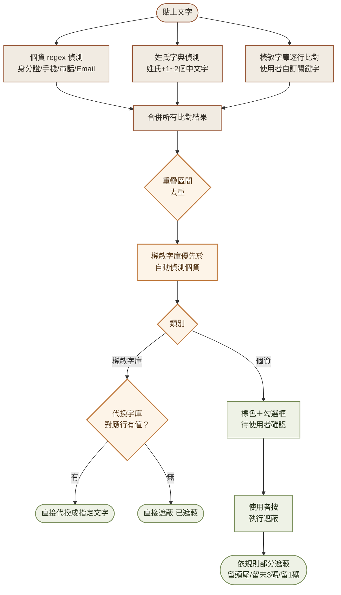
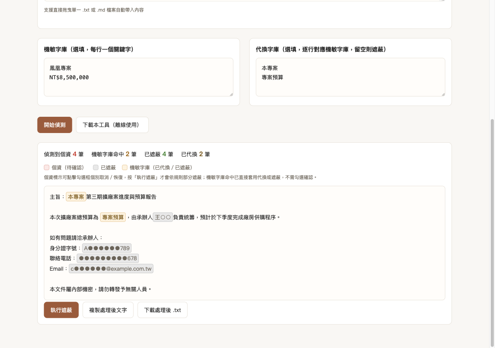
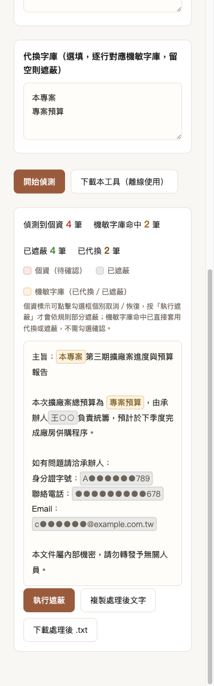

# Day 4：文件去識別化工具——外傳文件前的最後一道防線

> 🔀 **本內容原編號 Day4，因系列重新分類移至現在的 Day9，後續將延伸為「可逆式去識別化工具」。**

> 👉 **直接玩玩看**：[文件去識別化工具（GitHub Pages）](https://lushinshang.github.io/2026ironman/VibeCoding/Day9/index.html) ・ [原始碼](https://github.com/lushinshang/2026ironman/tree/main/VibeCoding/Day9)

**目錄**
[1. 情境](#1-情境) · [2. 解題思路](#2-解題思路) · [3. 資源](#3-資源) · [4. Vibe 過程](#4-vibe-過程) · [5. 產品](#5-產品) · [6. 心得與反思](#6-心得與反思)

---

## 1. 情境

Day3 的差異比對報告已經產出來了：合約改了三處條款，差異一目瞭然。下一步是把這份報告轉發給另一個承辦單位確認——但報告裡混著陳情人的身分證字號、聯絡電話，還有這個案子內部才知道的專案代號跟預算金額。這些東西不能就這樣轉出去。

手動逐字檢查是最直覺的做法，但公文越長越容易漏看：身分證字號夾在一長串條文中間、電話號碼格式不統一（有的加括號、有的不加）、專案代號可能出現在標題也可能出現在內文好幾次。檢查一次沒抓到，這份文件就外流了。

這是 Day2「PDF 轉 TXT/MD」、Day3「文字差異比對器」之後，這條管線的最後一棒：轉文字、比對差異、外傳前先過濾個資與機敏內容。

## 2. 解題思路

「個資」跟「機敏資料」聽起來像同一件事，動手前先確認是不是能用同一套邏輯處理——答案是不能。身分證字號、手機號碼、Email 這些個資有固定格式，regex 抓得準；但一份文件裡真正機敏的東西，專案代號、預算金額、承辦人姓名，沒有任何固定格式可循，同一個詞在這份文件是機密，換一份文件可能就是可以公開的資訊。想用 AI 或語意判斷去猜「這段話是不是機密」，對一個零依賴、純前端的工具來說既做不到也不該做。於是拆成兩條路徑：個資走 regex 自動偵測，機敏資料改成使用者自己列一份清單，工具只做精確字串比對，不猜測。

路徑拆好之後，使用者提出「機敏字眼要能選擇遮蔽或代換」的需求，問題變成：如果一個機敏詞要換成別的寫法（例如把專案代號換成「本專案」這種通用說法），要怎麼讓使用者指定「這個詞換成那個詞」？一開始想到的做法是同一行寫 `原詞=代換詞`，使用者後來提出更直覺的設計：兩個框，機敏字庫跟代換字庫用行號位置對應——機敏字庫第一行對代換字庫第一行，第二行對第二行，代換字庫那一行留空就退回遮蔽。不需要學一個新的語法規則，兩個框並排貼上去就懂。

遮蔽方式本身也得重新想。一律換成 `[已遮蔽]` 會讓整段文字看起來像被挖空，讀者連原本是什麼類型的資料都看不出來，改成規則式部分遮蔽——身分證留頭尾、手機留末三碼、Email 的 @ 前只留第一碼、姓名留姓氏——保留判斷上下文所需的最少資訊，同時把敏感部分蓋掉。這順帶牽出要不要新增「姓名」這個個資類型：姓名沒有 regex 可循，但可以用一份常見中文姓氏字典做啟發式判斷（姓氏字＋緊接 1～2 個中文字），代價是會有已知的誤判（例如「王先生」也會被抓成候選姓名），這個限制誠實寫進文件，不假裝能做到 100% 準確。

還剩一個問題：要不要一律都需要人工確認才遮蔽？個資是自動偵測、有誤判風險，維持標色＋勾選確認的流程；機敏字庫是使用者自己明確列出來的清單，風險模型不一樣，改成偵測完直接套用，不需要再多一層確認。兩套流程刻意分開，畫面上也用不同的視覺語言——個資是待確認的勾選框，機敏字庫命中直接顯示套用後的結果。

## 3. 資源

- **Playwright MCP**：全程用來對本機伺服器實際操作工具，不只是測互動邏輯，也用 `browser_evaluate` 直接對偵測、遮蔽這些純函式灌測試資料逐一核對輸出
- **fresh agent 獨立驗收（兩輪）**：程式碼每完成一輪就派一支沒看過實作過程的 agent，只給驗收條件與產出位置，自己決定驗證方式
- **`node --check` 與 Node.js 手動跑真實樣本**：個資 regex、姓名字典、行號配對邏輯這些純函式，先在 Node.js 裡拿真實格式樣本驗證過一輪，才寫進瀏覽器頁面
- **PRD.md / proposal.md / tasks.md**：SDD 三階段的骨架，這次歷經三輪提案→實作→驗收（初版、規則式遮蔽＋機敏字庫代換擴充、單一 HTML 離線下載）

## 4. Vibe 過程

Day4 最花時間的不是寫程式，是規格討論本身。使用者一開始只說「機敏字眼可以選擇遮蔽或代換」，這句話本身沒講清楚三件事：代換值從哪裡輸入、遮蔽跟代換要不要分開觸發、個資要不要也比照辦理。沒有直接動手實作，而是逐輪把每個決定點攤開來問——先確認「機敏字庫」跟「代換字庫」是兩個獨立框還是同一行寫成 `原詞=代換詞`，再確認命中後是要跟個資一樣勾選確認，還是直接套用。這幾輪討論定案的設計（行號位置對應、機敏字庫直接套用），跟一開始設想的完全不一樣——如果沒有先問清楚就動手，很可能會把「原詞=代換詞」這種語法糖寫成正式功能，然後被要求砍掉重寫。

規格定案之後，實作階段抓到兩個真正的邏輯 bug，都不是程式碼審查看得出來的，是拿真實案例跑出數字對不上才發現。

機敏字庫允許使用者填入人名（例如承辦人姓名），但姓氏字典的自動偵測也會抓到同一段文字。合併去重時，原始寫法把自動偵測的個資陣列放在使用者手動輸入的機敏字庫陣列前面——這個順序聽起來無關緊要，實際上決定了「兩者重疊時誰贏」。用「鳳凰專案由王小明負責...李永昌也參與」這段真實案例測試，統計數字顯示機敏字庫命中數比預期少一筆，往回追才發現「李永昌」被自動偵測的姓名標籤蓋掉了，使用者在機敏字庫設定的代換完全沒有生效，也沒有任何錯誤或警告。修法很直接——機敏字庫是使用者明確指定的清單，理應優先於程式自己猜的結果，把合併順序反過來就好，但如果沒有用會讓兩者重疊的真實案例去測，這個問題根本不會被發現，因為單獨測試機敏字庫、單獨測試姓名偵測，兩邊都各自運作正常。

同一輪還藏著性質類似的第二處疏漏：「已遮蔽」的統計數字，把機敏字庫命中的筆數也算了進去。原因是合併陣列時，每一筆資料（不分個資或機敏字庫）都預設 `selected: true`，而統計邏輯原本用「所有 selected 的項目」計數，沒有另外篩選類別。新增一個分類欄位到共用資料結構之後，只改了新功能自己用到的地方，沒有回頭檢查舊有統計邏輯要不要跟著調整——同一套「合併處理、忘記分流」的疏漏，在同一輪出現了兩次。

兩個問題都修好之後，重新用同一組真實案例跑一遍，數字才終於對得上。

## 5. 產品

最後交付的是一個零外部函式庫依賴的 `index.html`，貼上文字、貼機敏字庫與代換字庫，按下偵測，個資標色待確認、機敏字庫命中直接套用代換或遮蔽。下圖是實際貼進一份模擬公文後、執行遮蔽的結果——機敏字庫的「鳳凰專案」「NT$8,500,000」直接代換成「本專案」「專案預算」，個資則依類型部分遮蔽：姓名留姓氏（王○○）、身分證留頭尾、手機留末三碼、Email 的 @ 前只留第一碼：

<table>
<tr>
<td width="50%">

**桌面版**（機敏字庫代換與個資規則式遮蔽並存）

</td>
<td width="50%">

**手機版**（375px 寬，單欄堆疊排版，遮蔽效果與桌面版一致）

</td>
</tr>
</table>

功能清單：

- 貼上或拖曳 .txt/.md 檔案，自動偵測身分證字號、手機、市話（含分機）、Email、常見姓氏姓名
- 個資標示可個別勾選確認，執行遮蔽後依類型套用規則式部分遮蔽（不是統一蓋成同一個符號）
- 機敏字庫與代換字庫兩個並排輸入框，行號一對一對應，命中直接套用代換或退回遮蔽，不需額外確認
- 統計摘要區分「已遮蔽」與「已代換」筆數
- 複製／下載處理後文字
- 單一 HTML 離線下載，離線複本不含下載按鈕自己、不含外部連結，拖曳功能依然可用
- 全程零外部請求，所有偵測與遮蔽都在瀏覽器本機完成

已知限制（如實列出，不迴避）：

- 姓名偵測是啟發式判斷，靠固定姓氏字典比對「姓氏＋緊接 1～2 個中文字」，不是真正的命名實體辨識——單一姓氏字出現在句子中但不是當姓名使用時（例如「王先生說」）會被誤判為姓名候選；複姓、字典未收錄的罕見姓氏會被漏掉
- 不偵測地址、生日、銀行帳號、信用卡卡號（格式變體太多，regex 誤判率高，明確排除在範圍外）
- 機敏字庫與代換字庫只支援精確字串比對，不做模糊比對或語意判斷

**線上體驗**：[lushinshang.github.io/2026ironman/VibeCoding/Day9](https://lushinshang.github.io/2026ironman/VibeCoding/Day9/index.html)
**原始碼**：[github.com/lushinshang/2026ironman](https://github.com/lushinshang/2026ironman/tree/main/VibeCoding/Day9)

## 6. 心得與反思

Day4 跟前三天最大的不同，是花在「把需求問清楚」的時間比花在寫程式的時間還多。使用者一句「機敏字眼可以選擇遮蔽或代換」背後藏著至少四個要決定的細節（代換值從哪來、要不要分開觸發、個資要不要一併比照、代換字庫要不要也需要人工確認），每個都直接影響最後的資料結構跟互動設計。如果照第一直覺就動手做「原詞=代換詞」這種語法糖，很可能做完才被要求砍掉重做——先把每個決定點攤開來問，看起來慢，其實是把返工的風險提早消化掉。

兩個實作階段抓到的 bug，回頭看都是同一種疏漏：把「使用者明確指定的東西」跟「程式自動猜測的結果」放進同一個陣列統一處理，卻沒有想清楚兩者的優先序不對等；新增一個分類欄位之後，只改了新功能自己的邏輯，沒有回頭檢查舊邏輯要不要跟著分流。這兩個問題都只有拿一個「刻意讓兩種類別同時命中重疊」的真實案例去測才會現形——分開測試機敏字庫、分開測試姓名偵測，兩邊都各自正常，只有合在一起才會露出馬腳。這跟 Day2、Day3 學到的教訓是同一個道理：合成測試資料驗證的是「我想到的情境」，只有刻意設計會互相干擾的真實案例，才驗證得到「我沒想到的情境」。

單一 HTML 離線下載這個功能，這次直接把 Day3 事後才補修的教訓（下載按鈕忘記從離線複本移除）寫進提案階段的任務清單，一次到位，沒有再犯同一個坑。踩過的坑寫下來、下一次真的能避開，這是這幾天下來最實際的收穫。
